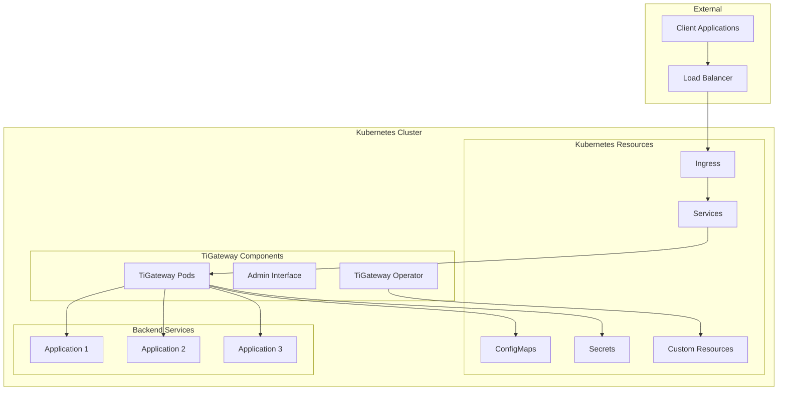

# Kubernetes Native

TiGateway is designed from the ground up to be Kubernetes-native, providing seamless integration with the Kubernetes ecosystem and leveraging its powerful features for service discovery, configuration management, and deployment.

## Kubernetes Integration Overview



## Service Discovery

### Automatic Service Discovery

TiGateway automatically discovers services in the Kubernetes cluster using the Kubernetes API:

```yaml
spring:
  cloud:
    gateway:
      discovery:
        locator:
          enabled: true
          lower-case-service-id: true
          predicates:
            - name: Path
              args:
                pattern: "'/'+serviceId+'/**'"
          filters:
            - name: RewritePath
              args:
                regexp: "'/'+serviceId+'/(?<remaining>.*)'"
                replacement: "'/${remaining}'"
```

### Service Discovery Configuration

```yaml
apiVersion: v1
kind: ConfigMap
metadata:
  name: tigateway-service-discovery
  namespace: tigateway
data:
  application.yml: |
    spring:
      cloud:
        kubernetes:
          discovery:
            enabled: true
            include-not-ready-addresses: false
            namespaces:
              - default
              - production
              - staging
          config:
            enabled: true
            sources:
              - name: tigateway-config
                namespace: tigateway
```

## Configuration Management

### ConfigMap Integration

TiGateway uses ConfigMaps for configuration storage and management:

```yaml
apiVersion: v1
kind: ConfigMap
metadata:
  name: tigateway-config
  namespace: tigateway
data:
  application.yml: |
    server:
      port: 8080
    spring:
      cloud:
        gateway:
          routes:
            - id: user-service-route
              uri: lb://user-service
              predicates:
                - Path=/api/users/**
              filters:
                - StripPrefix=2
  routes.yml: |
    routes:
      - id: order-service-route
        uri: lb://order-service
        predicates:
          - Path=/api/orders/**
        filters:
          - StripPrefix=2
          - AddRequestHeader=X-Service,order-service
```

### Dynamic Configuration Updates

TiGateway automatically reloads configuration when ConfigMaps are updated:

```yaml
apiVersion: v1
kind: ConfigMap
metadata:
  name: tigateway-config
  namespace: tigateway
  annotations:
    tigateway.cn/reload: "true"
data:
  application.yml: |
    # Configuration will be automatically reloaded
    spring:
      cloud:
        gateway:
          routes:
            - id: updated-route
              uri: lb://updated-service
              predicates:
                - Path=/api/updated/**
```

## Custom Resource Definitions (CRDs)

### TiGateway CRD

```yaml
apiVersion: apiextensions.k8s.io/v1
kind: CustomResourceDefinition
metadata:
  name: tigateways.tigateway.cn
spec:
  group: tigateway.cn
  versions:
  - name: v1
    served: true
    storage: true
    schema:
      openAPIV3Schema:
        type: object
        properties:
          spec:
            type: object
            properties:
              replicas:
                type: integer
                minimum: 1
                maximum: 10
              image:
                type: string
              resources:
                type: object
                properties:
                  requests:
                    type: object
                    properties:
                      memory:
                        type: string
                      cpu:
                        type: string
                  limits:
                    type: object
                    properties:
                      memory:
                        type: string
                      cpu:
                        type: string
  scope: Namespaced
  names:
    plural: tigateways
    singular: tigateway
    kind: TiGateway
    shortNames:
    - tg
```

### TiGatewayRouteConfig CRD

```yaml
apiVersion: apiextensions.k8s.io/v1
kind: CustomResourceDefinition
metadata:
  name: tigatewayrouteconfigs.tigateway.cn
spec:
  group: tigateway.cn
  versions:
  - name: v1
    served: true
    storage: true
    schema:
      openAPIV3Schema:
        type: object
        properties:
          spec:
            type: object
            properties:
              routes:
                type: array
                items:
                  type: object
                  properties:
                    id:
                      type: string
                    uri:
                      type: string
                    predicates:
                      type: array
                      items:
                        type: object
                        properties:
                          name:
                            type: string
                          args:
                            type: object
                    filters:
                      type: array
                      items:
                        type: object
                        properties:
                          name:
                            type: string
                          args:
                            type: object
  scope: Namespaced
  names:
    plural: tigatewayrouteconfigs
    singular: tigatewayrouteconfig
    kind: TiGatewayRouteConfig
    shortNames:
    - tgrc
```

## Operator Pattern

### TiGateway Operator

The TiGateway Operator manages TiGateway instances using the operator pattern:

```go
// TiGateway Controller
type TiGatewayReconciler struct {
    client.Client
    Scheme *runtime.Scheme
}

func (r *TiGatewayReconciler) Reconcile(ctx context.Context, req ctrl.Request) (ctrl.Result, error) {
    var tigateway tigatewayv1.TiGateway
    if err := r.Get(ctx, req.NamespacedName, &tigateway); err != nil {
        return ctrl.Result{}, client.IgnoreNotFound(err)
    }
    
    // Reconcile deployment
    if err := r.reconcileDeployment(ctx, &tigateway); err != nil {
        return ctrl.Result{}, err
    }
    
    // Reconcile service
    if err := r.reconcileService(ctx, &tigateway); err != nil {
        return ctrl.Result{}, err
    }
    
    // Reconcile configmap
    if err := r.reconcileConfigMap(ctx, &tigateway); err != nil {
        return ctrl.Result{}, err
    }
    
    return ctrl.Result{}, nil
}
```

### Operator Deployment

```yaml
apiVersion: apps/v1
kind: Deployment
metadata:
  name: tigateway-operator
  namespace: tigateway-system
spec:
  replicas: 1
  selector:
    matchLabels:
      app: tigateway-operator
  template:
    metadata:
      labels:
        app: tigateway-operator
    spec:
      serviceAccountName: tigateway-operator
      containers:
      - name: operator
        image: tigateway/operator:1.0.0
        env:
        - name: WATCH_NAMESPACE
          value: ""
        - name: POD_NAME
          valueFrom:
            fieldRef:
              fieldPath: metadata.name
        - name: OPERATOR_NAME
          value: "tigateway-operator"
```

## Ingress Integration

### Ingress Controller Integration

TiGateway can work with various Ingress controllers:

```yaml
apiVersion: networking.k8s.io/v1
kind: Ingress
metadata:
  name: tigateway-ingress
  namespace: tigateway
  annotations:
    kubernetes.io/ingress.class: "nginx"
    nginx.ingress.kubernetes.io/rewrite-target: /
    nginx.ingress.kubernetes.io/ssl-redirect: "true"
spec:
  tls:
  - hosts:
    - tigateway.example.com
    secretName: tigateway-tls
  rules:
  - host: tigateway.example.com
    http:
      paths:
      - path: /
        pathType: Prefix
        backend:
          service:
            name: tigateway
            port:
              number: 8080
```

### IngressClass Configuration

```yaml
apiVersion: networking.k8s.io/v1
kind: IngressClass
metadata:
  name: tigateway
  annotations:
    ingressclass.kubernetes.io/is-default-class: "true"
spec:
  controller: tigateway.cn/ingress-controller
  parameters:
    apiGroup: tigateway.cn
    kind: TiGatewayIngressClassParams
    name: tigateway-params
```

## Security Integration

### RBAC Configuration

```yaml
apiVersion: v1
kind: ServiceAccount
metadata:
  name: tigateway
  namespace: tigateway
---
apiVersion: rbac.authorization.k8s.io/v1
kind: ClusterRole
metadata:
  name: tigateway
rules:
- apiGroups: [""]
  resources: ["services", "endpoints", "configmaps", "secrets"]
  verbs: ["get", "list", "watch"]
- apiGroups: ["apps"]
  resources: ["deployments", "replicasets"]
  verbs: ["get", "list", "watch"]
- apiGroups: ["tigateway.cn"]
  resources: ["tigateways", "tigatewayrouteconfigs", "tigatewaymappings"]
  verbs: ["get", "list", "watch", "create", "update", "patch", "delete"]
---
apiVersion: rbac.authorization.k8s.io/v1
kind: ClusterRoleBinding
metadata:
  name: tigateway
roleRef:
  apiGroup: rbac.authorization.k8s.io
  kind: ClusterRole
  name: tigateway
subjects:
- kind: ServiceAccount
  name: tigateway
  namespace: tigateway
```

### Network Policies

```yaml
apiVersion: networking.k8s.io/v1
kind: NetworkPolicy
metadata:
  name: tigateway-network-policy
  namespace: tigateway
spec:
  podSelector:
    matchLabels:
      app: tigateway
  policyTypes:
  - Ingress
  - Egress
  ingress:
  - from:
    - namespaceSelector:
        matchLabels:
          name: ingress-nginx
    ports:
    - protocol: TCP
      port: 8080
  egress:
  - to:
    - namespaceSelector:
        matchLabels:
          name: backend-services
    ports:
    - protocol: TCP
      port: 8080
```

## Monitoring Integration

### ServiceMonitor for Prometheus

```yaml
apiVersion: monitoring.coreos.com/v1
kind: ServiceMonitor
metadata:
  name: tigateway-monitor
  namespace: tigateway
  labels:
    app: tigateway
spec:
  selector:
    matchLabels:
      app: tigateway
  endpoints:
  - port: management
    path: /actuator/prometheus
    interval: 30s
    scrapeTimeout: 10s
```

### PodMonitor for Prometheus

```yaml
apiVersion: monitoring.coreos.com/v1
kind: PodMonitor
metadata:
  name: tigateway-pod-monitor
  namespace: tigateway
  labels:
    app: tigateway
spec:
  selector:
    matchLabels:
      app: tigateway
  podMetricsEndpoints:
  - port: management
    path: /actuator/prometheus
    interval: 30s
```

## Auto-scaling

### Horizontal Pod Autoscaler

```yaml
apiVersion: autoscaling/v2
kind: HorizontalPodAutoscaler
metadata:
  name: tigateway-hpa
  namespace: tigateway
spec:
  scaleTargetRef:
    apiVersion: apps/v1
    kind: Deployment
    name: tigateway
  minReplicas: 2
  maxReplicas: 10
  metrics:
  - type: Resource
    resource:
      name: cpu
      target:
        type: Utilization
        averageUtilization: 70
  - type: Resource
    resource:
      name: memory
      target:
        type: Utilization
        averageUtilization: 80
  - type: Pods
    pods:
      metric:
        name: http_requests_per_second
      target:
        type: AverageValue
        averageValue: "100"
```

### Vertical Pod Autoscaler

```yaml
apiVersion: autoscaling.k8s.io/v1
kind: VerticalPodAutoscaler
metadata:
  name: tigateway-vpa
  namespace: tigateway
spec:
  targetRef:
    apiVersion: apps/v1
    kind: Deployment
    name: tigateway
  updatePolicy:
    updateMode: "Auto"
  resourcePolicy:
    containerPolicies:
    - containerName: tigateway
      maxAllowed:
        cpu: 1
        memory: 2Gi
      minAllowed:
        cpu: 100m
        memory: 128Mi
```

## Deployment Strategies

### Rolling Update

```yaml
apiVersion: apps/v1
kind: Deployment
metadata:
  name: tigateway
  namespace: tigateway
spec:
  replicas: 3
  strategy:
    type: RollingUpdate
    rollingUpdate:
      maxUnavailable: 1
      maxSurge: 1
  selector:
    matchLabels:
      app: tigateway
  template:
    metadata:
      labels:
        app: tigateway
    spec:
      containers:
      - name: tigateway
        image: tigateway/tigateway:1.0.0
        ports:
        - containerPort: 8080
        readinessProbe:
          httpGet:
            path: /actuator/health/readiness
            port: 8080
          initialDelaySeconds: 5
          periodSeconds: 5
        livenessProbe:
          httpGet:
            path: /actuator/health/liveness
            port: 8080
          initialDelaySeconds: 30
          periodSeconds: 10
```

### Blue-Green Deployment

```yaml
apiVersion: argoproj.io/v1alpha1
kind: Rollout
metadata:
  name: tigateway-rollout
  namespace: tigateway
spec:
  replicas: 3
  strategy:
    blueGreen:
      activeService: tigateway-active
      previewService: tigateway-preview
      autoPromotionEnabled: false
      scaleDownDelaySeconds: 30
      prePromotionAnalysis:
        templates:
        - templateName: success-rate
        args:
        - name: service-name
          value: tigateway-preview
      postPromotionAnalysis:
        templates:
        - templateName: success-rate
        args:
        - name: service-name
          value: tigateway-active
  selector:
    matchLabels:
      app: tigateway
  template:
    metadata:
      labels:
        app: tigateway
    spec:
      containers:
      - name: tigateway
        image: tigateway/tigateway:1.0.0
        ports:
        - containerPort: 8080
```

## Best Practices

### 1. Resource Management

```yaml
# Resource quotas
apiVersion: v1
kind: ResourceQuota
metadata:
  name: tigateway-quota
  namespace: tigateway
spec:
  hard:
    requests.cpu: "2"
    requests.memory: 4Gi
    limits.cpu: "4"
    limits.memory: 8Gi
    pods: "10"
    services: "5"
    configmaps: "10"
    secrets: "5"
```

### 2. Namespace Organization

```yaml
# Namespace structure
apiVersion: v1
kind: Namespace
metadata:
  name: tigateway
  labels:
    name: tigateway
    tier: gateway
---
apiVersion: v1
kind: Namespace
metadata:
  name: tigateway-system
  labels:
    name: tigateway-system
    tier: system
```

### 3. Configuration Management

```yaml
# Configuration hierarchy
apiVersion: v1
kind: ConfigMap
metadata:
  name: tigateway-base-config
  namespace: tigateway
data:
  application.yml: |
    # Base configuration
    server:
      port: 8080
    spring:
      application:
        name: tigateway
---
apiVersion: v1
kind: ConfigMap
metadata:
  name: tigateway-env-config
  namespace: tigateway
data:
  application-env.yml: |
    # Environment-specific configuration
    spring:
      profiles:
        active: ${ENVIRONMENT:dev}
      cloud:
        gateway:
          routes:
            - id: env-specific-route
              uri: lb://${ENVIRONMENT}-service
```

## Troubleshooting

### Common Issues

#### Service Discovery Not Working

```bash
# Check service discovery
kubectl get services -n tigateway
kubectl get endpoints -n tigateway

# Check TiGateway logs
kubectl logs deployment/tigateway -n tigateway | grep -i discovery
```

#### Configuration Not Loading

```bash
# Check ConfigMap
kubectl get configmap tigateway-config -n tigateway -o yaml

# Check TiGateway logs
kubectl logs deployment/tigateway -n tigateway | grep -i config
```

#### Operator Issues

```bash
# Check operator logs
kubectl logs deployment/tigateway-operator -n tigateway-system

# Check CRD status
kubectl get tigateways -n tigateway
kubectl describe tigateway tigateway-instance -n tigateway
```

## Next Steps

After understanding Kubernetes integration:

1. **[Installation Guide](./installation.md)** - Deploy TiGateway in Kubernetes
2. **[Configuration Guide](./configuration.md)** - Configure TiGateway for Kubernetes
3. **[Deployment Guide](./deployment/kubernetes.md)** - Production deployment in Kubernetes
4. **[Monitoring Setup](./monitoring-and-metrics.md)** - Set up Kubernetes-native monitoring

---

**Ready to deploy in Kubernetes?** Check out our [Installation Guide](./installation.md) to get started.
