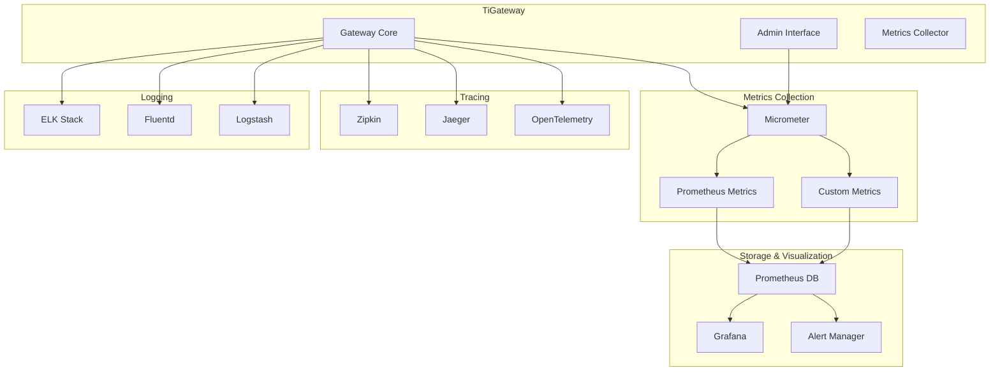

# Monitoring and Metrics

TiGateway provides comprehensive monitoring and metrics capabilities to help you understand system performance, track business metrics, and troubleshoot issues. This guide covers monitoring setup, metrics collection, alerting, and observability best practices.

## Overview

TiGateway monitoring includes:

- **System Metrics**: CPU, memory, JVM metrics
- **Application Metrics**: Request rates, response times, error rates
- **Business Metrics**: Custom business logic metrics
- **Health Checks**: Service health and availability
- **Distributed Tracing**: Request tracing across services
- **Logging**: Structured logging and log aggregation

## Monitoring Architecture



## 1. Metrics Configuration

### 1.1 Basic Metrics Setup

```yaml
management:
  endpoints:
    web:
      exposure:
        include: "*"
  endpoint:
    health:
      show-details: always
    metrics:
      enabled: true
  metrics:
    export:
      prometheus:
        enabled: true
    tags:
      application: tigateway
      environment: ${SPRING_PROFILES_ACTIVE:default}
```

### 1.2 Custom Metrics Configuration

```yaml
management:
  metrics:
    export:
      prometheus:
        enabled: true
        step: 10s
        descriptions: true
    distribution:
      percentiles-histogram:
        http.server.requests: true
        tigateway.requests: true
      percentiles:
        http.server.requests: 0.5, 0.95, 0.99
        tigateway.requests: 0.5, 0.95, 0.99
    tags:
      application: tigateway
      environment: ${SPRING_PROFILES_ACTIVE:default}
      region: ${REGION:unknown}
      datacenter: ${DATACENTER:unknown}
```

### 1.3 Advanced Metrics Configuration

```yaml
management:
  metrics:
    export:
      prometheus:
        enabled: true
        step: 10s
        descriptions: true
        histogram-flavor: prometheus
    distribution:
      percentiles-histogram:
        http.server.requests: true
        tigateway.requests: true
        tigateway.response.time: true
      percentiles:
        http.server.requests: 0.5, 0.95, 0.99
        tigateway.requests: 0.5, 0.95, 0.99
        tigateway.response.time: 0.5, 0.95, 0.99
      slo:
        http.server.requests: 50ms, 100ms, 200ms, 500ms, 1s, 2s, 5s
        tigateway.requests: 50ms, 100ms, 200ms, 500ms, 1s, 2s, 5s
    tags:
      application: tigateway
      environment: ${SPRING_PROFILES_ACTIVE:default}
      region: ${REGION:unknown}
      datacenter: ${DATACENTER:unknown}
      version: ${VERSION:unknown}
```

## 2. Built-in Metrics

### 2.1 HTTP Metrics

TiGateway automatically collects HTTP metrics for all requests:

```yaml
# HTTP Server Metrics
http_server_requests_seconds_count{method="GET",uri="/api/users",status="200"} 1000
http_server_requests_seconds_sum{method="GET",uri="/api/users",status="200"} 45.2
http_server_requests_seconds_max{method="GET",uri="/api/users",status="200"} 0.5

# HTTP Client Metrics (for outbound requests)
http_client_requests_seconds_count{method="GET",uri="http://user-service:8080/users",status="200"} 1000
http_client_requests_seconds_sum{method="GET",uri="http://user-service:8080/users",status="200"} 40.1
http_client_requests_seconds_max{method="GET",uri="http://user-service:8080/users",status="200"} 0.4
```

### 2.2 JVM Metrics

```yaml
# JVM Memory Metrics
jvm_memory_used_bytes{area="heap",id="PS Eden Space"} 134217728
jvm_memory_max_bytes{area="heap",id="PS Eden Space"} 268435456
jvm_memory_committed_bytes{area="heap",id="PS Eden Space"} 268435456

# JVM GC Metrics
jvm_gc_pause_seconds_count{action="end of minor GC",cause="Allocation Failure"} 100
jvm_gc_pause_seconds_sum{action="end of minor GC",cause="Allocation Failure"} 2.5
jvm_gc_pause_seconds_max{action="end of minor GC",cause="Allocation Failure"} 0.1

# JVM Thread Metrics
jvm_threads_live_threads 50
jvm_threads_daemon_threads 45
jvm_threads_peak_threads 60
```

### 2.3 System Metrics

```yaml
# System CPU Metrics
system_cpu_usage 0.45
system_load_average_1m 0.8
system_load_average_5m 0.7
system_load_average_15m 0.6

# System Memory Metrics
system_memory_total_bytes 8589934592
system_memory_free_bytes 4294967296
system_memory_used_bytes 4294967296
```

## 3. Custom Metrics

### 3.1 Custom Metrics Implementation

```java
@Component
public class TiGatewayMetrics {
    
    private final MeterRegistry meterRegistry;
    private final Counter requestCounter;
    private final Timer responseTimer;
    private final Gauge activeConnections;
    private final Counter errorCounter;
    private final Timer circuitBreakerTimer;
    
    public TiGatewayMetrics(MeterRegistry meterRegistry) {
        this.meterRegistry = meterRegistry;
        
        // Request counter
        this.requestCounter = Counter.builder("tigateway.requests.total")
                .description("Total number of requests")
                .tag("type", "gateway")
                .register(meterRegistry);
        
        // Response timer
        this.responseTimer = Timer.builder("tigateway.response.time")
                .description("Response time")
                .register(meterRegistry);
        
        // Active connections gauge
        this.activeConnections = Gauge.builder("tigateway.connections.active")
                .description("Active connections")
                .register(meterRegistry, this, TiGatewayMetrics::getActiveConnections);
        
        // Error counter
        this.errorCounter = Counter.builder("tigateway.errors.total")
                .description("Total number of errors")
                .register(meterRegistry);
        
        // Circuit breaker timer
        this.circuitBreakerTimer = Timer.builder("tigateway.circuit.breaker.time")
                .description("Circuit breaker response time")
                .register(meterRegistry);
    }
    
    public void incrementRequestCount(String route, String method, String status) {
        requestCounter.increment(
                Tags.of(
                        "route", route,
                        "method", method,
                        "status", status
                )
        );
    }
    
    public void recordResponseTime(Duration duration, String route) {
        responseTimer.record(duration, Tags.of("route", route));
    }
    
    public void incrementErrorCount(String route, String errorType) {
        errorCounter.increment(
                Tags.of(
                        "route", route,
                        "error_type", errorType
                )
        );
    }
    
    public void recordCircuitBreakerTime(Duration duration, String circuitBreakerName) {
        circuitBreakerTimer.record(duration, Tags.of("circuit_breaker", circuitBreakerName));
    }
    
    private double getActiveConnections() {
        // Implement logic to get active connections
        return 0.0;
    }
}
```

### 3.2 Business Metrics

```java
@Component
public class BusinessMetrics {
    
    private final MeterRegistry meterRegistry;
    private final Counter userLoginCounter;
    private final Timer userSessionTimer;
    private final Gauge activeUsers;
    
    public BusinessMetrics(MeterRegistry meterRegistry) {
        this.meterRegistry = meterRegistry;
        
        this.userLoginCounter = Counter.builder("tigateway.business.user.logins")
                .description("Total user logins")
                .register(meterRegistry);
        
        this.userSessionTimer = Timer.builder("tigateway.business.user.session.duration")
                .description("User session duration")
                .register(meterRegistry);
        
        this.activeUsers = Gauge.builder("tigateway.business.users.active")
                .description("Active users")
                .register(meterRegistry, this, BusinessMetrics::getActiveUsers);
    }
    
    public void recordUserLogin(String userId, String userType) {
        userLoginCounter.increment(
                Tags.of(
                        "user_id", userId,
                        "user_type", userType
                )
        );
    }
    
    public void recordUserSession(Duration duration, String userId) {
        userSessionTimer.record(duration, Tags.of("user_id", userId));
    }
    
    private double getActiveUsers() {
        // Implement logic to get active users
        return 0.0;
    }
}
```

### 3.3 Route-Specific Metrics

```java
@Component
public class RouteMetrics {
    
    private final MeterRegistry meterRegistry;
    private final Map<String, Counter> routeCounters = new ConcurrentHashMap<>();
    private final Map<String, Timer> routeTimers = new ConcurrentHashMap<>();
    
    public RouteMetrics(MeterRegistry meterRegistry) {
        this.meterRegistry = meterRegistry;
    }
    
    public void recordRouteRequest(String routeId, String method, String status) {
        String key = routeId + ":" + method + ":" + status;
        Counter counter = routeCounters.computeIfAbsent(key, k -> 
            Counter.builder("tigateway.route.requests")
                    .tag("route_id", routeId)
                    .tag("method", method)
                    .tag("status", status)
                    .register(meterRegistry)
        );
        counter.increment();
    }
    
    public void recordRouteResponseTime(String routeId, Duration duration) {
        Timer timer = routeTimers.computeIfAbsent(routeId, k ->
            Timer.builder("tigateway.route.response.time")
                    .tag("route_id", routeId)
                    .register(meterRegistry)
        );
        timer.record(duration);
    }
}
```

## 4. Health Checks

### 4.1 Basic Health Check Configuration

```yaml
management:
  endpoint:
    health:
      show-details: always
      show-components: always
  health:
    defaults:
      enabled: true
    diskspace:
      enabled: true
      threshold: 100MB
    db:
      enabled: true
    redis:
      enabled: true
    circuitbreakers:
      enabled: true
```

### 4.2 Custom Health Indicators

```java
@Component
public class TiGatewayHealthIndicator implements HealthIndicator {
    
    private final RouteService routeService;
    private final CircuitBreakerService circuitBreakerService;
    
    public TiGatewayHealthIndicator(RouteService routeService, 
                                   CircuitBreakerService circuitBreakerService) {
        this.routeService = routeService;
        this.circuitBreakerService = circuitBreakerService;
    }
    
    @Override
    public Health health() {
        try {
            // Check route service health
            List<Route> routes = routeService.getAllRoutes();
            if (routes.isEmpty()) {
                return Health.down()
                        .withDetail("routes", "No routes configured")
                        .build();
            }
            
            // Check circuit breaker health
            Map<String, CircuitBreakerState> circuitBreakers = 
                    circuitBreakerService.getCircuitBreakerStates();
            
            long openCircuitBreakers = circuitBreakers.values().stream()
                    .mapToLong(state -> state == CircuitBreakerState.OPEN ? 1 : 0)
                    .sum();
            
            if (openCircuitBreakers > 0) {
                return Health.down()
                        .withDetail("circuit_breakers", 
                                openCircuitBreakers + " circuit breakers are open")
                        .build();
            }
            
            return Health.up()
                    .withDetail("routes", routes.size() + " routes configured")
                    .withDetail("circuit_breakers", 
                            circuitBreakers.size() + " circuit breakers configured")
                    .build();
                    
        } catch (Exception e) {
            return Health.down()
                    .withDetail("error", e.getMessage())
                    .build();
        }
    }
}
```

### 4.3 Database Health Check

```java
@Component
public class DatabaseHealthIndicator implements HealthIndicator {
    
    private final DataSource dataSource;
    
    public DatabaseHealthIndicator(DataSource dataSource) {
        this.dataSource = dataSource;
    }
    
    @Override
    public Health health() {
        try (Connection connection = dataSource.getConnection()) {
            if (connection.isValid(1)) {
                return Health.up()
                        .withDetail("database", "Available")
                        .withDetail("validationQuery", "SELECT 1")
                        .build();
            } else {
                return Health.down()
                        .withDetail("database", "Connection validation failed")
                        .build();
            }
        } catch (SQLException e) {
            return Health.down()
                    .withDetail("database", "Connection failed")
                    .withDetail("error", e.getMessage())
                    .build();
        }
    }
}
```

## 5. Distributed Tracing

### 5.1 Tracing Configuration

```yaml
spring:
  sleuth:
    zipkin:
      base-url: http://zipkin:9411
    sampler:
      probability: 1.0
    web:
      client:
        enabled: true
    kafka:
      enabled: true
    redis:
      enabled: true
    jdbc:
      enabled: true
```

### 5.2 Custom Tracing

```java
@Component
public class CustomTracingService {
    
    private final Tracer tracer;
    
    public CustomTracingService(Tracer tracer) {
        this.tracer = tracer;
    }
    
    public void traceRouteExecution(String routeId, Runnable operation) {
        Span span = tracer.nextSpan()
                .name("route-execution")
                .tag("route.id", routeId)
                .start();
        
        try (Tracer.SpanInScope ws = tracer.withSpanInScope(span)) {
            operation.run();
        } catch (Exception e) {
            span.tag("error", true);
            span.tag("error.message", e.getMessage());
            throw e;
        } finally {
            span.end();
        }
    }
    
    public void traceCircuitBreaker(String circuitBreakerName, Runnable operation) {
        Span span = tracer.nextSpan()
                .name("circuit-breaker-execution")
                .tag("circuit.breaker.name", circuitBreakerName)
                .start();
        
        try (Tracer.SpanInScope ws = tracer.withSpanInScope(span)) {
            operation.run();
        } catch (Exception e) {
            span.tag("error", true);
            span.tag("error.message", e.getMessage());
            throw e;
        } finally {
            span.end();
        }
    }
}
```

## 6. Logging Configuration

### 6.1 Structured Logging

```yaml
logging:
  level:
    ti.gateway: INFO
    org.springframework.cloud.gateway: INFO
    org.springframework.web: INFO
  pattern:
    console: "%d{yyyy-MM-dd HH:mm:ss} [%thread] %-5level [%X{traceId},%X{spanId}] %logger{36} - %msg%n"
    file: "%d{yyyy-MM-dd HH:mm:ss} [%thread] %-5level [%X{traceId},%X{spanId}] %logger{36} - %msg%n"
  file:
    name: logs/tigateway.log
    max-size: 100MB
    max-history: 30
```

### 6.2 JSON Logging

```yaml
logging:
  level:
    ti.gateway: INFO
  pattern:
    console: "%msg%n"
  file:
    name: logs/tigateway.json
  logback:
    rollingpolicy:
      file-name-pattern: logs/tigateway.%d{yyyy-MM-dd}.%i.json
```

### 6.3 Custom Logging Configuration

```xml
<!-- logback-spring.xml -->
<configuration>
    <appender name="STDOUT" class="ch.qos.logback.core.ConsoleAppender">
        <encoder class="net.logstash.logback.encoder.LoggingEventCompositeJsonEncoder">
            <providers>
                <timestamp/>
                <logLevel/>
                <loggerName/>
                <message/>
                <mdc/>
                <stackTrace/>
            </providers>
        </encoder>
    </appender>
    
    <appender name="FILE" class="ch.qos.logback.core.rolling.RollingFileAppender">
        <file>logs/tigateway.json</file>
        <rollingPolicy class="ch.qos.logback.core.rolling.TimeBasedRollingPolicy">
            <fileNamePattern>logs/tigateway.%d{yyyy-MM-dd}.%i.json</fileNamePattern>
            <maxFileSize>100MB</maxFileSize>
            <maxHistory>30</maxHistory>
        </rollingPolicy>
        <encoder class="net.logstash.logback.encoder.LoggingEventCompositeJsonEncoder">
            <providers>
                <timestamp/>
                <logLevel/>
                <loggerName/>
                <message/>
                <mdc/>
                <stackTrace/>
            </providers>
        </encoder>
    </appender>
    
    <root level="INFO">
        <appender-ref ref="STDOUT"/>
        <appender-ref ref="FILE"/>
    </root>
</configuration>
```

## 7. Prometheus Integration

### 7.1 Prometheus Configuration

```yaml
# prometheus.yml
global:
  scrape_interval: 15s
  evaluation_interval: 15s

rule_files:
  - "tigateway_rules.yml"

scrape_configs:
  - job_name: 'tigateway'
    static_configs:
      - targets: ['tigateway:8080']
    metrics_path: '/actuator/prometheus'
    scrape_interval: 10s
    scrape_timeout: 5s
```

### 7.2 Prometheus Rules

```yaml
# tigateway_rules.yml
groups:
- name: tigateway
  rules:
  - alert: TiGatewayDown
    expr: up{job="tigateway"} == 0
    for: 1m
    labels:
      severity: critical
    annotations:
      summary: "TiGateway instance is down"
      description: "TiGateway instance {{ $labels.instance }} has been down for more than 1 minute."
  
  - alert: HighErrorRate
    expr: rate(tigateway_errors_total[5m]) > 0.1
    for: 2m
    labels:
      severity: warning
    annotations:
      summary: "High error rate detected"
      description: "Error rate is {{ $value }} errors per second."
  
  - alert: HighResponseTime
    expr: histogram_quantile(0.95, rate(tigateway_response_time_seconds_bucket[5m])) > 1
    for: 5m
    labels:
      severity: warning
    annotations:
      summary: "High response time detected"
      description: "95th percentile response time is {{ $value }} seconds."
  
  - alert: CircuitBreakerOpen
    expr: tigateway_circuit_breaker_state{state="open"} == 1
    for: 1m
    labels:
      severity: critical
    annotations:
      summary: "Circuit breaker is open"
      description: "Circuit breaker {{ $labels.circuit_breaker }} is open."
```

### 7.3 ServiceMonitor for Kubernetes

```yaml
apiVersion: monitoring.coreos.com/v1
kind: ServiceMonitor
metadata:
  name: tigateway-monitor
  namespace: tigateway
  labels:
    app: tigateway
spec:
  selector:
    matchLabels:
      app: tigateway
  endpoints:
  - port: management
    path: /actuator/prometheus
    interval: 30s
    scrapeTimeout: 10s
    honorLabels: true
    metricRelabelings:
    - sourceLabels: [__name__]
      regex: 'jvm_.*'
      action: drop
```

## 8. Grafana Dashboards

### 8.1 Basic Dashboard

```json
{
  "dashboard": {
    "id": null,
    "title": "TiGateway Dashboard",
    "tags": ["tigateway", "gateway", "api"],
    "timezone": "browser",
    "panels": [
      {
        "id": 1,
        "title": "Request Rate",
        "type": "graph",
        "targets": [
          {
            "expr": "rate(tigateway_requests_total[5m])",
            "legendFormat": "{{route}} {{method}}"
          }
        ]
      },
      {
        "id": 2,
        "title": "Response Time",
        "type": "graph",
        "targets": [
          {
            "expr": "histogram_quantile(0.95, rate(tigateway_response_time_seconds_bucket[5m]))",
            "legendFormat": "95th percentile"
          },
          {
            "expr": "histogram_quantile(0.50, rate(tigateway_response_time_seconds_bucket[5m]))",
            "legendFormat": "50th percentile"
          }
        ]
      },
      {
        "id": 3,
        "title": "Error Rate",
        "type": "graph",
        "targets": [
          {
            "expr": "rate(tigateway_errors_total[5m])",
            "legendFormat": "{{route}} {{error_type}}"
          }
        ]
      },
      {
        "id": 4,
        "title": "Active Connections",
        "type": "singlestat",
        "targets": [
          {
            "expr": "tigateway_connections_active",
            "legendFormat": "Active Connections"
          }
        ]
      }
    ]
  }
}
```

### 8.2 Advanced Dashboard

```json
{
  "dashboard": {
    "id": null,
    "title": "TiGateway Advanced Dashboard",
    "tags": ["tigateway", "gateway", "api", "advanced"],
    "timezone": "browser",
    "panels": [
      {
        "id": 1,
        "title": "Request Rate by Route",
        "type": "graph",
        "targets": [
          {
            "expr": "sum(rate(tigateway_requests_total[5m])) by (route_id)",
            "legendFormat": "{{route_id}}"
          }
        ]
      },
      {
        "id": 2,
        "title": "Response Time Distribution",
        "type": "heatmap",
        "targets": [
          {
            "expr": "rate(tigateway_response_time_seconds_bucket[5m])",
            "legendFormat": "{{le}}"
          }
        ]
      },
      {
        "id": 3,
        "title": "Circuit Breaker Status",
        "type": "table",
        "targets": [
          {
            "expr": "tigateway_circuit_breaker_state",
            "legendFormat": "{{circuit_breaker}}"
          }
        ]
      },
      {
        "id": 4,
        "title": "JVM Memory Usage",
        "type": "graph",
        "targets": [
          {
            "expr": "jvm_memory_used_bytes{area=\"heap\"}",
            "legendFormat": "{{id}}"
          }
        ]
      },
      {
        "id": 5,
        "title": "GC Pause Time",
        "type": "graph",
        "targets": [
          {
            "expr": "rate(jvm_gc_pause_seconds_sum[5m])",
            "legendFormat": "{{action}}"
          }
        ]
      }
    ]
  }
}
```

## 9. Alerting

### 9.1 AlertManager Configuration

```yaml
# alertmanager.yml
global:
  smtp_smarthost: 'localhost:587'
  smtp_from: 'alerts@tigateway.com'

route:
  group_by: ['alertname']
  group_wait: 10s
  group_interval: 10s
  repeat_interval: 1h
  receiver: 'web.hook'

receivers:
- name: 'web.hook'
  webhook_configs:
  - url: 'http://webhook:5001/'
    send_resolved: true

- name: 'email'
  email_configs:
  - to: 'admin@tigateway.com'
    subject: 'TiGateway Alert: {{ .GroupLabels.alertname }}'
    body: |
      {{ range .Alerts }}
      Alert: {{ .Annotations.summary }}
      Description: {{ .Annotations.description }}
      {{ end }}
```

### 9.2 Custom Alert Rules

```yaml
# tigateway_alerts.yml
groups:
- name: tigateway.alerts
  rules:
  - alert: TiGatewayHighErrorRate
    expr: rate(tigateway_errors_total[5m]) > 0.05
    for: 2m
    labels:
      severity: warning
      service: tigateway
    annotations:
      summary: "High error rate in TiGateway"
      description: "Error rate is {{ $value }} errors per second for the last 5 minutes."
      runbook_url: "https://docs.tigateway.com/runbooks/high-error-rate"
  
  - alert: TiGatewayHighResponseTime
    expr: histogram_quantile(0.95, rate(tigateway_response_time_seconds_bucket[5m])) > 2
    for: 5m
    labels:
      severity: warning
      service: tigateway
    annotations:
      summary: "High response time in TiGateway"
      description: "95th percentile response time is {{ $value }} seconds."
      runbook_url: "https://docs.tigateway.com/runbooks/high-response-time"
  
  - alert: TiGatewayCircuitBreakerOpen
    expr: tigateway_circuit_breaker_state{state="open"} == 1
    for: 1m
    labels:
      severity: critical
      service: tigateway
    annotations:
      summary: "Circuit breaker is open"
      description: "Circuit breaker {{ $labels.circuit_breaker }} is open."
      runbook_url: "https://docs.tigateway.com/runbooks/circuit-breaker-open"
  
  - alert: TiGatewayHighMemoryUsage
    expr: jvm_memory_used_bytes{area="heap"} / jvm_memory_max_bytes{area="heap"} > 0.8
    for: 5m
    labels:
      severity: warning
      service: tigateway
    annotations:
      summary: "High memory usage in TiGateway"
      description: "Memory usage is {{ $value | humanizePercentage }} of maximum."
      runbook_url: "https://docs.tigateway.com/runbooks/high-memory-usage"
```

## 10. Best Practices

### 10.1 Metrics Collection

- **Use appropriate metric types**: Counter for counts, Timer for durations, Gauge for current values
- **Add meaningful tags**: Include relevant dimensions like route, method, status
- **Avoid high cardinality**: Don't add tags with many unique values
- **Use histograms for distributions**: For response times and other distributions
- **Set appropriate sampling rates**: Balance between accuracy and performance

### 10.2 Alerting

- **Set meaningful thresholds**: Based on SLOs and business requirements
- **Use appropriate alert durations**: Avoid false positives from temporary spikes
- **Include runbook URLs**: Help operators understand how to resolve issues
- **Group related alerts**: Reduce alert fatigue
- **Test alerting**: Regularly test alerting to ensure it works

### 10.3 Logging

- **Use structured logging**: JSON format for better parsing and analysis
- **Include correlation IDs**: For tracing requests across services
- **Log at appropriate levels**: DEBUG for development, INFO for production
- **Avoid logging sensitive data**: Don't log passwords, tokens, or PII
- **Use log aggregation**: Centralize logs for analysis

### 10.4 Performance

- **Monitor resource usage**: CPU, memory, disk, network
- **Set up capacity planning**: Monitor trends and plan for growth
- **Use caching**: Cache frequently accessed data
- **Optimize queries**: For database and external service calls
- **Monitor external dependencies**: Track health and performance of downstream services

## 11. Troubleshooting

### 11.1 Common Issues

#### Metrics Not Appearing

```bash
# Check if metrics endpoint is accessible
curl http://localhost:8080/actuator/prometheus

# Check if Prometheus is scraping
curl http://prometheus:9090/api/v1/targets

# Check application logs
tail -f logs/tigateway.log | grep -i metric
```

#### High Memory Usage

```bash
# Check JVM memory usage
curl http://localhost:8080/actuator/metrics/jvm.memory.used

# Check heap dump
jcmd <pid> GC.run_finalization
jcmd <pid> VM.gc

# Check for memory leaks
jmap -histo <pid>
```

#### Slow Response Times

```bash
# Check response time metrics
curl http://localhost:8080/actuator/metrics/tigateway.response.time

# Check slow queries
curl http://localhost:8080/actuator/metrics/http.server.requests

# Check external service response times
curl http://localhost:8080/actuator/metrics/http.client.requests
```

### 11.2 Debug Commands

```bash
# Check health status
curl http://localhost:8080/actuator/health

# Check all metrics
curl http://localhost:8080/actuator/metrics

# Check specific metric
curl http://localhost:8080/actuator/metrics/tigateway.requests.total

# Check Prometheus metrics
curl http://localhost:8080/actuator/prometheus

# Check trace information
curl http://localhost:8080/actuator/httptrace
```

## Next Steps

After setting up monitoring:

1. **[Security Best Practices](../security-best-practices.md)** - Secure your monitoring setup
2. **[Troubleshooting Guide](../troubleshooting.md)** - Common issues and solutions
3. **[Performance Tuning](../performance-tuning.md)** - Optimize performance based on metrics
4. **[Production Deployment](../deployment/kubernetes.md)** - Deploy with monitoring in production

---

**Ready to secure your setup?** Check out our [Security Best Practices](../security-best-practices.md) guide.
