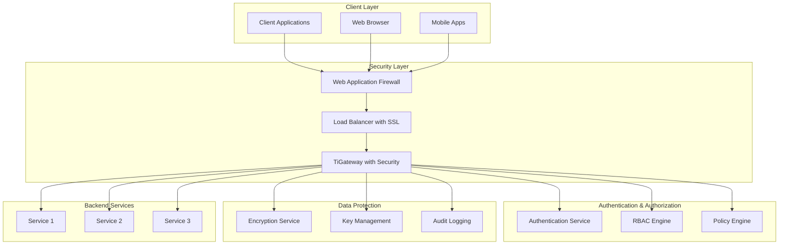

# Security Best Practices

This guide provides comprehensive security best practices for TiGateway, covering authentication, authorization, data protection, network security, and compliance requirements.

## Overview

TiGateway security includes:

- **Authentication**: JWT, OAuth2, API keys, multi-factor authentication
- **Authorization**: Role-based access control (RBAC), attribute-based access control (ABAC)
- **Data Protection**: Encryption at rest and in transit, data masking, PII protection
- **Network Security**: TLS/SSL, network policies, firewall rules
- **API Security**: Rate limiting, input validation, CORS, CSRF protection
- **Compliance**: GDPR, HIPAA, SOC 2, PCI DSS requirements

## Security Architecture



## 1. Authentication

### 1.1 JWT Authentication

```yaml
spring:
  security:
    oauth2:
      client:
        registration:
          gateway:
            client-id: ${OAUTH2_CLIENT_ID}
            client-secret: ${OAUTH2_CLIENT_SECRET}
            scope: read,write
        provider:
          gateway:
            authorization-uri: ${OAUTH2_AUTHORIZATION_URI}
            token-uri: ${OAUTH2_TOKEN_URI}
            user-info-uri: ${OAUTH2_USER_INFO_URI}
            jwk-set-uri: ${OAUTH2_JWK_SET_URI}
      resourceserver:
        jwt:
          jwk-set-uri: ${OAUTH2_JWK_SET_URI}
          issuer-uri: ${OAUTH2_ISSUER_URI}
```

### 1.2 JWT Configuration

```java
@Configuration
@EnableWebSecurity
public class SecurityConfig {
    
    @Bean
    public SecurityWebFilterChain securityWebFilterChain(ServerHttpSecurity http) {
        return http
                .authorizeExchange(exchanges -> exchanges
                        .pathMatchers("/actuator/health").permitAll()
                        .pathMatchers("/actuator/info").permitAll()
                        .pathMatchers("/api/public/**").permitAll()
                        .pathMatchers("/api/admin/**").hasRole("ADMIN")
                        .pathMatchers("/api/user/**").hasAnyRole("USER", "ADMIN")
                        .anyExchange().authenticated()
                )
                .oauth2ResourceServer(oauth2 -> oauth2
                        .jwt(jwt -> jwt
                                .jwtDecoder(jwtDecoder())
                                .jwtAuthenticationConverter(jwtAuthenticationConverter())
                        )
                )
                .csrf(csrf -> csrf.disable())
                .build();
    }
    
    @Bean
    public ReactiveJwtDecoder jwtDecoder() {
        return NimbusReactiveJwtDecoder.withJwkSetUri(jwkSetUri)
                .jwsAlgorithm(SignatureAlgorithm.RS256)
                .build();
    }
    
    @Bean
    public Converter<Jwt, Mono<AbstractAuthenticationToken>> jwtAuthenticationConverter() {
        JwtAuthenticationConverter converter = new JwtAuthenticationConverter();
        converter.setJwtGrantedAuthoritiesConverter(jwt -> {
            List<String> roles = jwt.getClaimAsStringList("roles");
            return roles.stream()
                    .map(role -> new SimpleGrantedAuthority("ROLE_" + role))
                    .collect(Collectors.toList());
        });
        return new ReactiveJwtAuthenticationConverterAdapter(converter);
    }
}
```

### 1.3 API Key Authentication

```java
@Component
public class ApiKeyAuthenticationFilter implements GatewayFilter {
    
    private final ApiKeyService apiKeyService;
    
    public ApiKeyAuthenticationFilter(ApiKeyService apiKeyService) {
        this.apiKeyService = apiKeyService;
    }
    
    @Override
    public Mono<Void> filter(ServerWebExchange exchange, GatewayFilterChain chain) {
        ServerHttpRequest request = exchange.getRequest();
        
        String apiKey = extractApiKey(request);
        if (apiKey == null) {
            return unauthorized(exchange, "Missing API key");
        }
        
        return apiKeyService.validateApiKey(apiKey)
                .flatMap(valid -> {
                    if (valid) {
                        ApiKeyInfo apiKeyInfo = apiKeyService.getApiKeyInfo(apiKey);
                        ServerHttpRequest modifiedRequest = request.mutate()
                                .header("X-API-Key-Id", apiKeyInfo.getId())
                                .header("X-API-Key-User", apiKeyInfo.getUserId())
                                .header("X-API-Key-Roles", String.join(",", apiKeyInfo.getRoles()))
                                .build();
                        
                        return chain.filter(exchange.mutate().request(modifiedRequest).build());
                    } else {
                        return unauthorized(exchange, "Invalid API key");
                    }
                });
    }
    
    private String extractApiKey(ServerHttpRequest request) {
        // Try X-API-Key header first
        String apiKey = request.getHeaders().getFirst("X-API-Key");
        if (apiKey != null) {
            return apiKey;
        }
        
        // Try Authorization header
        String authHeader = request.getHeaders().getFirst("Authorization");
        if (authHeader != null && authHeader.startsWith("Bearer ")) {
            return authHeader.substring(7);
        }
        
        // Try query parameter
        return request.getQueryParams().getFirst("api_key");
    }
    
    private Mono<Void> unauthorized(ServerWebExchange exchange, String message) {
        ServerHttpResponse response = exchange.getResponse();
        response.setStatusCode(HttpStatus.UNAUTHORIZED);
        response.getHeaders().add("Content-Type", "application/json");
        
        String body = String.format("{\"error\":\"Unauthorized\",\"message\":\"%s\"}", message);
        DataBuffer buffer = response.bufferFactory().wrap(body.getBytes());
        return response.writeWith(Mono.just(buffer));
    }
}
```

### 1.4 Multi-Factor Authentication

```java
@Component
public class MfaAuthenticationFilter implements GatewayFilter {
    
    private final MfaService mfaService;
    
    public MfaAuthenticationFilter(MfaService mfaService) {
        this.mfaService = mfaService;
    }
    
    @Override
    public Mono<Void> filter(ServerWebExchange exchange, GatewayFilterChain chain) {
        ServerHttpRequest request = exchange.getRequest();
        
        String userId = request.getHeaders().getFirst("X-User-Id");
        String mfaToken = request.getHeaders().getFirst("X-MFA-Token");
        
        if (userId == null) {
            return chain.filter(exchange);
        }
        
        return mfaService.isMfaRequired(userId)
                .flatMap(required -> {
                    if (required) {
                        if (mfaToken == null) {
                            return mfaRequired(exchange);
                        }
                        
                        return mfaService.validateMfaToken(userId, mfaToken)
                                .flatMap(valid -> {
                                    if (valid) {
                                        return chain.filter(exchange);
                                    } else {
                                        return mfaInvalid(exchange);
                                    }
                                });
                    } else {
                        return chain.filter(exchange);
                    }
                });
    }
    
    private Mono<Void> mfaRequired(ServerWebExchange exchange) {
        ServerHttpResponse response = exchange.getResponse();
        response.setStatusCode(HttpStatus.UNAUTHORIZED);
        response.getHeaders().add("Content-Type", "application/json");
        response.getHeaders().add("X-MFA-Required", "true");
        
        String body = "{\"error\":\"MFA Required\",\"message\":\"Multi-factor authentication is required\"}";
        DataBuffer buffer = response.bufferFactory().wrap(body.getBytes());
        return response.writeWith(Mono.just(buffer));
    }
    
    private Mono<Void> mfaInvalid(ServerWebExchange exchange) {
        ServerHttpResponse response = exchange.getResponse();
        response.setStatusCode(HttpStatus.UNAUTHORIZED);
        response.getHeaders().add("Content-Type", "application/json");
        
        String body = "{\"error\":\"MFA Invalid\",\"message\":\"Invalid multi-factor authentication token\"}";
        DataBuffer buffer = response.bufferFactory().wrap(body.getBytes());
        return response.writeWith(Mono.just(buffer));
    }
}
```

## 2. Authorization

### 2.1 Role-Based Access Control (RBAC)

```java
@Component
public class RbacAuthorizationFilter implements GatewayFilter {
    
    private final RbacService rbacService;
    
    public RbacAuthorizationFilter(RbacService rbacService) {
        this.rbacService = rbacService;
    }
    
    @Override
    public Mono<Void> filter(ServerWebExchange exchange, GatewayFilterChain chain) {
        ServerHttpRequest request = exchange.getRequest();
        
        String userId = request.getHeaders().getFirst("X-User-Id");
        String userRoles = request.getHeaders().getFirst("X-User-Roles");
        String resource = request.getPath().value();
        String action = request.getMethod().name();
        
        if (userId == null) {
            return unauthorized(exchange, "User not authenticated");
        }
        
        List<String> roles = Arrays.asList(userRoles.split(","));
        
        return rbacService.hasPermission(roles, resource, action)
                .flatMap(hasPermission -> {
                    if (hasPermission) {
                        return chain.filter(exchange);
                    } else {
                        return forbidden(exchange, "Insufficient permissions");
                    }
                });
    }
    
    private Mono<Void> unauthorized(ServerWebExchange exchange, String message) {
        ServerHttpResponse response = exchange.getResponse();
        response.setStatusCode(HttpStatus.UNAUTHORIZED);
        response.getHeaders().add("Content-Type", "application/json");
        
        String body = String.format("{\"error\":\"Unauthorized\",\"message\":\"%s\"}", message);
        DataBuffer buffer = response.bufferFactory().wrap(body.getBytes());
        return response.writeWith(Mono.just(buffer));
    }
    
    private Mono<Void> forbidden(ServerWebExchange exchange, String message) {
        ServerHttpResponse response = exchange.getResponse();
        response.setStatusCode(HttpStatus.FORBIDDEN);
        response.getHeaders().add("Content-Type", "application/json");
        
        String body = String.format("{\"error\":\"Forbidden\",\"message\":\"%s\"}", message);
        DataBuffer buffer = response.bufferFactory().wrap(body.getBytes());
        return response.writeWith(Mono.just(buffer));
    }
}
```

### 2.2 Attribute-Based Access Control (ABAC)

```java
@Component
public class AbacAuthorizationFilter implements GatewayFilter {
    
    private final AbacService abacService;
    
    public AbacAuthorizationFilter(AbacService abacService) {
        this.abacService = abacService;
    }
    
    @Override
    public Mono<Void> filter(ServerWebExchange exchange, GatewayFilterChain chain) {
        ServerHttpRequest request = exchange.getRequest();
        
        String userId = request.getHeaders().getFirst("X-User-Id");
        String userRoles = request.getHeaders().getFirst("X-User-Roles");
        String userDepartment = request.getHeaders().getFirst("X-User-Department");
        String resource = request.getPath().value();
        String action = request.getMethod().name();
        
        if (userId == null) {
            return unauthorized(exchange, "User not authenticated");
        }
        
        // Build subject attributes
        Map<String, Object> subjectAttributes = new HashMap<>();
        subjectAttributes.put("user_id", userId);
        subjectAttributes.put("roles", Arrays.asList(userRoles.split(",")));
        subjectAttributes.put("department", userDepartment);
        subjectAttributes.put("ip_address", getClientIp(request));
        subjectAttributes.put("user_agent", request.getHeaders().getFirst("User-Agent"));
        
        // Build resource attributes
        Map<String, Object> resourceAttributes = new HashMap<>();
        resourceAttributes.put("resource", resource);
        resourceAttributes.put("action", action);
        resourceAttributes.put("method", request.getMethod().name());
        
        // Build environment attributes
        Map<String, Object> environmentAttributes = new HashMap<>();
        environmentAttributes.put("time", Instant.now());
        environmentAttributes.put("day_of_week", LocalDate.now().getDayOfWeek());
        environmentAttributes.put("hour", LocalTime.now().getHour());
        
        return abacService.evaluatePolicy(subjectAttributes, resourceAttributes, environmentAttributes)
                .flatMap(decision -> {
                    if (decision.isPermit()) {
                        return chain.filter(exchange);
                    } else {
                        return forbidden(exchange, "Access denied: " + decision.getReason());
                    }
                });
    }
    
    private String getClientIp(ServerHttpRequest request) {
        String xForwardedFor = request.getHeaders().getFirst("X-Forwarded-For");
        if (xForwardedFor != null && !xForwardedFor.isEmpty()) {
            return xForwardedFor.split(",")[0].trim();
        }
        
        String xRealIp = request.getHeaders().getFirst("X-Real-IP");
        if (xRealIp != null && !xRealIp.isEmpty()) {
            return xRealIp;
        }
        
        return request.getRemoteAddress() != null ? 
                request.getRemoteAddress().getAddress().getHostAddress() : "unknown";
    }
}
```

### 2.3 Policy Engine Configuration

```yaml
# Policy configuration
abac:
  policies:
    - name: "admin-access"
      description: "Admin users can access admin resources"
      rules:
        - subject:
            roles: ["ADMIN"]
          resource:
            path: "/api/admin/**"
          action: ["GET", "POST", "PUT", "DELETE"]
          effect: "PERMIT"
    
    - name: "user-access"
      description: "Users can access user resources"
      rules:
        - subject:
            roles: ["USER", "ADMIN"]
          resource:
            path: "/api/user/**"
          action: ["GET", "POST", "PUT"]
          effect: "PERMIT"
    
    - name: "time-based-access"
      description: "Access only during business hours"
      rules:
        - subject:
            roles: ["USER"]
          resource:
            path: "/api/sensitive/**"
          action: ["GET", "POST"]
          environment:
            hour: [9, 10, 11, 12, 13, 14, 15, 16, 17]
            day_of_week: ["MONDAY", "TUESDAY", "WEDNESDAY", "THURSDAY", "FRIDAY"]
          effect: "PERMIT"
```

## 3. Data Protection

### 3.1 Encryption at Rest

```yaml
spring:
  datasource:
    url: jdbc:postgresql://localhost:5432/tigateway
    username: ${DB_USERNAME}
    password: ${DB_PASSWORD}
    hikari:
      connection-test-query: SELECT 1
      connection-timeout: 30000
      idle-timeout: 600000
      max-lifetime: 1800000
      maximum-pool-size: 10
  jpa:
    properties:
      hibernate:
        encryption:
          provider: "org.hibernate.cipher.AESProvider"
          algorithm: "AES"
          key: ${ENCRYPTION_KEY}
```

### 3.2 Encryption in Transit

```yaml
server:
  port: 8080
  ssl:
    enabled: true
    key-store: classpath:keystore.p12
    key-store-password: ${SSL_KEYSTORE_PASSWORD}
    key-store-type: PKCS12
    key-alias: tigateway
    trust-store: classpath:truststore.p12
    trust-store-password: ${SSL_TRUSTSTORE_PASSWORD}
    trust-store-type: PKCS12
    client-auth: want
    ciphers: TLS_ECDHE_RSA_WITH_AES_256_GCM_SHA384,TLS_ECDHE_RSA_WITH_AES_128_GCM_SHA256
    protocols: TLSv1.2,TLSv1.3
```

### 3.3 Data Masking

```java
@Component
public class DataMaskingFilter implements GatewayFilter {
    
    private final ObjectMapper objectMapper;
    private final List<String> sensitiveFields = Arrays.asList(
            "password", "ssn", "credit_card", "email", "phone"
    );
    
    public DataMaskingFilter(ObjectMapper objectMapper) {
        this.objectMapper = objectMapper;
    }
    
    @Override
    public Mono<Void> filter(ServerWebExchange exchange, GatewayFilterChain chain) {
        return chain.filter(exchange)
                .doOnSuccess(aVoid -> maskResponseData(exchange))
                .doOnError(throwable -> maskResponseData(exchange));
    }
    
    private void maskResponseData(ServerWebExchange exchange) {
        ServerHttpResponse response = exchange.getResponse();
        
        // Add response interceptor to mask sensitive data
        response.beforeCommit(() -> {
            // Implement response data masking
            return Mono.empty();
        });
    }
    
    public String maskSensitiveData(String json) {
        try {
            JsonNode rootNode = objectMapper.readTree(json);
            maskNode(rootNode);
            return objectMapper.writeValueAsString(rootNode);
        } catch (Exception e) {
            return json;
        }
    }
    
    private void maskNode(JsonNode node) {
        if (node.isObject()) {
            ObjectNode objectNode = (ObjectNode) node;
            objectNode.fieldNames().forEachRemaining(fieldName -> {
                if (sensitiveFields.contains(fieldName.toLowerCase())) {
                    objectNode.put(fieldName, "***MASKED***");
                } else {
                    JsonNode childNode = objectNode.get(fieldName);
                    if (childNode.isObject() || childNode.isArray()) {
                        maskNode(childNode);
                    }
                }
            });
        } else if (node.isArray()) {
            ArrayNode arrayNode = (ArrayNode) node;
            for (int i = 0; i < arrayNode.size(); i++) {
                maskNode(arrayNode.get(i));
            }
        }
    }
}
```

### 3.4 PII Protection

```java
@Component
public class PiiProtectionFilter implements GatewayFilter {
    
    private final PiiService piiService;
    
    public PiiProtectionFilter(PiiService piiService) {
        this.piiService = piiService;
    }
    
    @Override
    public Mono<Void> filter(ServerWebExchange exchange, GatewayFilterChain chain) {
        ServerHttpRequest request = exchange.getRequest();
        
        // Check if request contains PII
        return piiService.containsPii(request)
                .flatMap(containsPii -> {
                    if (containsPii) {
                        // Log PII access
                        piiService.logPiiAccess(request);
                        
                        // Check if user has permission to access PII
                        String userId = request.getHeaders().getFirst("X-User-Id");
                        return piiService.hasPiiPermission(userId)
                                .flatMap(hasPermission -> {
                                    if (hasPermission) {
                                        return chain.filter(exchange);
                                    } else {
                                        return forbidden(exchange, "PII access not permitted");
                                    }
                                });
                    } else {
                        return chain.filter(exchange);
                    }
                });
    }
}
```

## 4. Network Security

### 4.1 TLS Configuration

```yaml
server:
  port: 8080
  ssl:
    enabled: true
    key-store: classpath:keystore.p12
    key-store-password: ${SSL_KEYSTORE_PASSWORD}
    key-store-type: PKCS12
    key-alias: tigateway
    trust-store: classpath:truststore.p12
    trust-store-password: ${SSL_TRUSTSTORE_PASSWORD}
    trust-store-type: PKCS12
    client-auth: want
    ciphers: TLS_ECDHE_RSA_WITH_AES_256_GCM_SHA384,TLS_ECDHE_RSA_WITH_AES_128_GCM_SHA256
    protocols: TLSv1.2,TLSv1.3
    enabled-protocols: TLSv1.2,TLSv1.3
    enabled-cipher-suites: TLS_ECDHE_RSA_WITH_AES_256_GCM_SHA384,TLS_ECDHE_RSA_WITH_AES_128_GCM_SHA256
```

### 4.2 Network Policies

```yaml
apiVersion: networking.k8s.io/v1
kind: NetworkPolicy
metadata:
  name: tigateway-network-policy
  namespace: tigateway
spec:
  podSelector:
    matchLabels:
      app: tigateway
  policyTypes:
  - Ingress
  - Egress
  ingress:
  - from:
    - namespaceSelector:
        matchLabels:
          name: ingress-nginx
    - namespaceSelector:
        matchLabels:
          name: monitoring
    ports:
    - protocol: TCP
      port: 8080
    - protocol: TCP
      port: 8081
  egress:
  - to:
    - namespaceSelector:
        matchLabels:
          name: backend-services
    ports:
    - protocol: TCP
      port: 8080
    - protocol: TCP
      port: 443
  - to: []
    ports:
    - protocol: TCP
      port: 53
    - protocol: UDP
      port: 53
```

### 4.3 Firewall Rules

```yaml
# iptables rules for TiGateway
iptables -A INPUT -p tcp --dport 8080 -j ACCEPT
iptables -A INPUT -p tcp --dport 8081 -j ACCEPT
iptables -A INPUT -p tcp --dport 443 -j ACCEPT
iptables -A INPUT -p tcp --dport 80 -j ACCEPT
iptables -A INPUT -j DROP

# Allow only specific IP ranges
iptables -A INPUT -s 10.0.0.0/8 -p tcp --dport 8080 -j ACCEPT
iptables -A INPUT -s 172.16.0.0/12 -p tcp --dport 8080 -j ACCEPT
iptables -A INPUT -s 192.168.0.0/16 -p tcp --dport 8080 -j ACCEPT
iptables -A INPUT -p tcp --dport 8080 -j DROP
```

## 5. API Security

### 5.1 Rate Limiting

```yaml
spring:
  cloud:
    gateway:
      routes:
        - id: rate-limited-route
          uri: lb://user-service
          predicates:
            - Path=/api/users/**
          filters:
            - StripPrefix=2
            - name: RequestRateLimiter
              args:
                redis-rate-limiter.replenishRate: 100
                redis-rate-limiter.burstCapacity: 200
                key-resolver: "#{@userKeyResolver}"
```

### 5.2 Input Validation

```java
@Component
public class InputValidationFilter implements GatewayFilter {
    
    private final ValidationService validationService;
    
    public InputValidationFilter(ValidationService validationService) {
        this.validationService = validationService;
    }
    
    @Override
    public Mono<Void> filter(ServerWebExchange exchange, GatewayFilterChain chain) {
        ServerHttpRequest request = exchange.getRequest();
        
        // Validate request size
        if (request.getHeaders().getContentLength() > MAX_REQUEST_SIZE) {
            return badRequest(exchange, "Request too large");
        }
        
        // Validate content type
        String contentType = request.getHeaders().getFirst("Content-Type");
        if (contentType != null && !isAllowedContentType(contentType)) {
            return badRequest(exchange, "Unsupported content type");
        }
        
        // Validate request parameters
        return validationService.validateRequest(request)
                .flatMap(valid -> {
                    if (valid) {
                        return chain.filter(exchange);
                    } else {
                        return badRequest(exchange, "Invalid request parameters");
                    }
                });
    }
    
    private boolean isAllowedContentType(String contentType) {
        return contentType.startsWith("application/json") ||
               contentType.startsWith("application/xml") ||
               contentType.startsWith("text/plain");
    }
    
    private Mono<Void> badRequest(ServerWebExchange exchange, String message) {
        ServerHttpResponse response = exchange.getResponse();
        response.setStatusCode(HttpStatus.BAD_REQUEST);
        response.getHeaders().add("Content-Type", "application/json");
        
        String body = String.format("{\"error\":\"Bad Request\",\"message\":\"%s\"}", message);
        DataBuffer buffer = response.bufferFactory().wrap(body.getBytes());
        return response.writeWith(Mono.just(buffer));
    }
}
```

### 5.3 CORS Configuration

```yaml
spring:
  cloud:
    gateway:
      globalcors:
        cors-configurations:
          '[/**]':
            allowed-origins: 
              - "https://example.com"
              - "https://app.example.com"
            allowed-methods:
              - GET
              - POST
              - PUT
              - DELETE
              - OPTIONS
            allowed-headers:
              - "*"
            allow-credentials: true
            max-age: 3600
```

### 5.4 CSRF Protection

```java
@Component
public class CsrfProtectionFilter implements GatewayFilter {
    
    private final CsrfService csrfService;
    
    public CsrfProtectionFilter(CsrfService csrfService) {
        this.csrfService = csrfService;
    }
    
    @Override
    public Mono<Void> filter(ServerWebExchange exchange, GatewayFilterChain chain) {
        ServerHttpRequest request = exchange.getRequest();
        
        // Skip CSRF check for safe methods
        if (isSafeMethod(request.getMethod())) {
            return chain.filter(exchange);
        }
        
        // Skip CSRF check for API endpoints
        if (isApiEndpoint(request.getPath().value())) {
            return chain.filter(exchange);
        }
        
        String csrfToken = request.getHeaders().getFirst("X-CSRF-Token");
        String sessionId = request.getHeaders().getFirst("X-Session-ID");
        
        return csrfService.validateCsrfToken(sessionId, csrfToken)
                .flatMap(valid -> {
                    if (valid) {
                        return chain.filter(exchange);
                    } else {
                        return forbidden(exchange, "Invalid CSRF token");
                    }
                });
    }
    
    private boolean isSafeMethod(HttpMethod method) {
        return method == HttpMethod.GET || 
               method == HttpMethod.HEAD || 
               method == HttpMethod.OPTIONS;
    }
    
    private boolean isApiEndpoint(String path) {
        return path.startsWith("/api/");
    }
}
```

## 6. Compliance

### 6.1 GDPR Compliance

```java
@Component
public class GdprComplianceFilter implements GatewayFilter {
    
    private final GdprService gdprService;
    
    public GdprComplianceFilter(GdprService gdprService) {
        this.gdprService = gdprService;
    }
    
    @Override
    public Mono<Void> filter(ServerWebExchange exchange, GatewayFilterChain chain) {
        ServerHttpRequest request = exchange.getRequest();
        
        // Check if request involves personal data
        return gdprService.involvesPersonalData(request)
                .flatMap(involvesPersonalData -> {
                    if (involvesPersonalData) {
                        // Log data processing
                        gdprService.logDataProcessing(request);
                        
                        // Check consent
                        String userId = request.getHeaders().getFirst("X-User-Id");
                        return gdprService.hasConsent(userId)
                                .flatMap(hasConsent -> {
                                    if (hasConsent) {
                                        return chain.filter(exchange);
                                    } else {
                                        return forbidden(exchange, "Consent required for data processing");
                                    }
                                });
                    } else {
                        return chain.filter(exchange);
                    }
                });
    }
}
```

### 6.2 Audit Logging

```java
@Component
public class AuditLoggingFilter implements GatewayFilter {
    
    private final AuditService auditService;
    
    public AuditLoggingFilter(AuditService auditService) {
        this.auditService = auditService;
    }
    
    @Override
    public Mono<Void> filter(ServerWebExchange exchange, GatewayFilterChain chain) {
        ServerHttpRequest request = exchange.getRequest();
        
        return chain.filter(exchange)
                .doOnSuccess(aVoid -> auditService.logSuccess(request, exchange.getResponse()))
                .doOnError(throwable -> auditService.logError(request, throwable));
    }
}
```

### 6.3 Data Retention

```yaml
# Data retention configuration
data:
  retention:
    logs:
      duration: 90d
      archive: true
    metrics:
      duration: 1y
      archive: true
    audit:
      duration: 7y
      archive: true
    personal-data:
      duration: 3y
      archive: false
      anonymize: true
```

## 7. Security Monitoring

### 7.1 Security Metrics

```java
@Component
public class SecurityMetrics {
    
    private final MeterRegistry meterRegistry;
    private final Counter authenticationFailures;
    private final Counter authorizationFailures;
    private final Counter rateLimitExceeded;
    private final Counter suspiciousActivity;
    
    public SecurityMetrics(MeterRegistry meterRegistry) {
        this.meterRegistry = meterRegistry;
        
        this.authenticationFailures = Counter.builder("tigateway.security.auth.failures")
                .description("Authentication failures")
                .register(meterRegistry);
        
        this.authorizationFailures = Counter.builder("tigateway.security.authz.failures")
                .description("Authorization failures")
                .register(meterRegistry);
        
        this.rateLimitExceeded = Counter.builder("tigateway.security.rate_limit.exceeded")
                .description("Rate limit exceeded")
                .register(meterRegistry);
        
        this.suspiciousActivity = Counter.builder("tigateway.security.suspicious.activity")
                .description("Suspicious activity detected")
                .register(meterRegistry);
    }
    
    public void recordAuthenticationFailure(String reason) {
        authenticationFailures.increment(Tags.of("reason", reason));
    }
    
    public void recordAuthorizationFailure(String resource, String action) {
        authorizationFailures.increment(Tags.of("resource", resource, "action", action));
    }
    
    public void recordRateLimitExceeded(String clientId) {
        rateLimitExceeded.increment(Tags.of("client_id", clientId));
    }
    
    public void recordSuspiciousActivity(String activityType) {
        suspiciousActivity.increment(Tags.of("activity_type", activityType));
    }
}
```

### 7.2 Security Alerts

```yaml
# Security alert rules
groups:
- name: tigateway.security
  rules:
  - alert: TiGatewayAuthenticationFailures
    expr: rate(tigateway_security_auth_failures_total[5m]) > 10
    for: 2m
    labels:
      severity: warning
      service: tigateway
    annotations:
      summary: "High authentication failure rate"
      description: "Authentication failure rate is {{ $value }} failures per second."
  
  - alert: TiGatewaySuspiciousActivity
    expr: rate(tigateway_security_suspicious_activity_total[5m]) > 5
    for: 1m
    labels:
      severity: critical
      service: tigateway
    annotations:
      summary: "Suspicious activity detected"
      description: "Suspicious activity rate is {{ $value }} activities per second."
  
  - alert: TiGatewayRateLimitExceeded
    expr: rate(tigateway_security_rate_limit_exceeded_total[5m]) > 20
    for: 2m
    labels:
      severity: warning
      service: tigateway
    annotations:
      summary: "High rate limit exceeded rate"
      description: "Rate limit exceeded rate is {{ $value }} per second."
```

## 8. Best Practices

### 8.1 Authentication

- **Use strong authentication**: Implement multi-factor authentication for sensitive operations
- **Rotate credentials regularly**: Implement credential rotation policies
- **Use secure token storage**: Store tokens securely and implement token expiration
- **Implement session management**: Proper session lifecycle management
- **Monitor authentication**: Track authentication failures and suspicious activity

### 8.2 Authorization

- **Principle of least privilege**: Grant minimum required permissions
- **Regular access reviews**: Review and audit access permissions regularly
- **Implement RBAC/ABAC**: Use role-based or attribute-based access control
- **Separate concerns**: Separate authentication and authorization logic
- **Audit authorization decisions**: Log all authorization decisions

### 8.3 Data Protection

- **Encrypt sensitive data**: Use encryption for data at rest and in transit
- **Implement data masking**: Mask sensitive data in logs and responses
- **Data classification**: Classify data based on sensitivity
- **Data retention policies**: Implement appropriate data retention policies
- **PII protection**: Implement PII detection and protection

### 8.4 Network Security

- **Use TLS/SSL**: Encrypt all network communications
- **Implement network segmentation**: Use network policies and firewalls
- **Monitor network traffic**: Monitor for suspicious network activity
- **Use secure protocols**: Use only secure network protocols
- **Implement DDoS protection**: Protect against distributed denial of service attacks

### 8.5 API Security

- **Input validation**: Validate all input data
- **Rate limiting**: Implement rate limiting to prevent abuse
- **CORS configuration**: Configure CORS appropriately
- **CSRF protection**: Implement CSRF protection for web applications
- **API versioning**: Use API versioning for security updates

### 8.6 Compliance

- **Understand requirements**: Understand applicable compliance requirements
- **Implement controls**: Implement appropriate security controls
- **Regular audits**: Conduct regular security audits
- **Documentation**: Maintain security documentation
- **Training**: Provide security training to staff

## 9. Troubleshooting

### 9.1 Common Security Issues

#### Authentication Failures

```bash
# Check authentication logs
tail -f logs/tigateway.log | grep -i "authentication"

# Check JWT token validity
curl -H "Authorization: Bearer <token>" http://localhost:8080/actuator/health

# Check authentication service
curl http://localhost:8080/actuator/health
```

#### Authorization Failures

```bash
# Check authorization logs
tail -f logs/tigateway.log | grep -i "authorization"

# Check user permissions
curl -H "Authorization: Bearer <token>" http://localhost:8080/actuator/health

# Check RBAC configuration
curl http://localhost:8080/actuator/config
```

#### SSL/TLS Issues

```bash
# Check SSL certificate
openssl s_client -connect localhost:8080 -servername localhost

# Check SSL configuration
curl -v https://localhost:8080/actuator/health

# Check certificate expiration
openssl x509 -in certificate.crt -text -noout
```

### 9.2 Security Debug Commands

```bash
# Check security metrics
curl http://localhost:8080/actuator/metrics/tigateway.security.auth.failures

# Check security health
curl http://localhost:8080/actuator/health

# Check security configuration
curl http://localhost:8080/actuator/configprops | grep -i security

# Check security logs
tail -f logs/tigateway.log | grep -i security
```

## Next Steps

After implementing security:

1. **[Monitoring Setup](../monitoring-and-metrics.md)** - Set up security monitoring
2. **[Troubleshooting Guide](../troubleshooting.md)** - Common security issues and solutions
3. **[Performance Tuning](../performance-tuning.md)** - Optimize performance with security
4. **[Production Deployment](../deployment/kubernetes.md)** - Deploy securely in production

---

**Ready to monitor your security?** Check out our [Monitoring Setup](../monitoring-and-metrics.md) guide.
