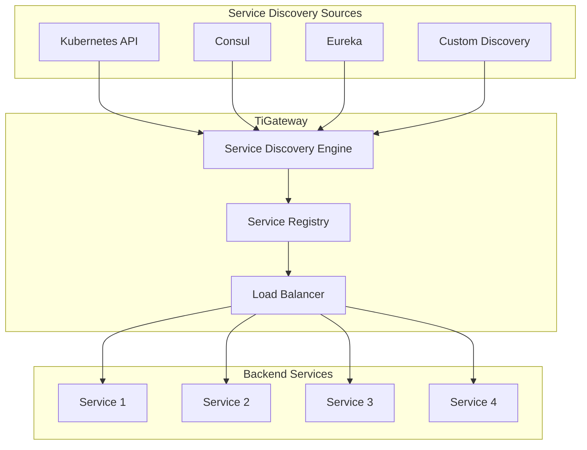

# Service Discovery

TiGateway provides comprehensive service discovery capabilities that automatically detect and route to services in your infrastructure. It supports multiple service discovery mechanisms including Kubernetes native discovery, Consul, Eureka, and custom discovery implementations.

## Service Discovery Overview



## Kubernetes Service Discovery

### Automatic Service Discovery

TiGateway automatically discovers services in the Kubernetes cluster:

```yaml
spring:
  cloud:
    gateway:
      discovery:
        locator:
          enabled: true
          lower-case-service-id: true
          predicates:
            - name: Path
              args:
                pattern: "'/'+serviceId+'/**'"
          filters:
            - name: RewritePath
              args:
                regexp: "'/'+serviceId+'/(?<remaining>.*)'"
                replacement: "'/${remaining}'"
```

### Kubernetes Discovery Configuration

```yaml
apiVersion: v1
kind: ConfigMap
metadata:
  name: tigateway-discovery-config
  namespace: tigateway
data:
  application.yml: |
    spring:
      cloud:
        kubernetes:
          discovery:
            enabled: true
            include-not-ready-addresses: false
            namespaces:
              - default
              - production
              - staging
            service-labels:
              discovery: "enabled"
          config:
            enabled: true
            sources:
              - name: tigateway-config
                namespace: tigateway
```

### Service Discovery with Labels

```yaml
apiVersion: v1
kind: Service
metadata:
  name: user-service
  namespace: production
  labels:
    app: user-service
    discovery: "enabled"
    version: "v1"
spec:
  selector:
    app: user-service
  ports:
  - port: 8080
    targetPort: 8080
    name: http
  type: ClusterIP
```

## Consul Service Discovery

### Consul Integration

```yaml
spring:
  cloud:
    consul:
      host: consul-server
      port: 8500
      discovery:
        enabled: true
        service-name: tigateway
        instance-id: ${spring.application.name}:${server.port}
        health-check-path: /actuator/health
        health-check-interval: 10s
        tags:
          - gateway
          - api
```

### Consul Service Registration

```yaml
apiVersion: v1
kind: ConfigMap
metadata:
  name: consul-service-config
  namespace: tigateway
data:
  application.yml: |
    spring:
      cloud:
        consul:
          discovery:
            enabled: true
            service-name: tigateway
            instance-id: tigateway-${HOSTNAME}
            health-check-path: /actuator/health
            health-check-interval: 10s
            tags:
              - gateway
              - kubernetes
              - production
```

### Consul Service Discovery Routes

```yaml
spring:
  cloud:
    gateway:
      routes:
        - id: consul-user-service
          uri: lb://user-service
          predicates:
            - Path=/api/users/**
          filters:
            - StripPrefix=2
            - AddRequestHeader=X-Service-Discovery,consul
```

## Eureka Service Discovery

### Eureka Integration

```yaml
spring:
  cloud:
    netflix:
      eureka:
        client:
          enabled: true
          service-url:
            defaultZone: http://eureka-server:8761/eureka/
          register-with-eureka: true
          fetch-registry: true
        instance:
          prefer-ip-address: true
          instance-id: ${spring.application.name}:${server.port}
          health-check-url-path: /actuator/health
          status-page-url-path: /actuator/info
```

### Eureka Service Registration

```yaml
apiVersion: v1
kind: ConfigMap
metadata:
  name: eureka-service-config
  namespace: tigateway
data:
  application.yml: |
    spring:
      cloud:
        netflix:
          eureka:
            client:
              enabled: true
              service-url:
                defaultZone: http://eureka-server:8761/eureka/
              register-with-eureka: true
              fetch-registry: true
            instance:
              prefer-ip-address: true
              instance-id: tigateway-${HOSTNAME}
              health-check-url-path: /actuator/health
              status-page-url-path: /actuator/info
              metadata-map:
                zone: production
                region: us-east-1
```

### Eureka Service Discovery Routes

```yaml
spring:
  cloud:
    gateway:
      routes:
        - id: eureka-order-service
          uri: lb://order-service
          predicates:
            - Path=/api/orders/**
          filters:
            - StripPrefix=2
            - AddRequestHeader=X-Service-Discovery,eureka
```

## Custom Service Discovery

### Custom Discovery Implementation

```java
@Component
public class CustomServiceDiscovery implements ServiceDiscovery {
    
    private final ServiceRegistry serviceRegistry;
    private final LoadBalancerClient loadBalancerClient;
    
    public CustomServiceDiscovery(ServiceRegistry serviceRegistry, 
                                 LoadBalancerClient loadBalancerClient) {
        this.serviceRegistry = serviceRegistry;
        this.loadBalancerClient = loadBalancerClient;
    }
    
    @Override
    public List<ServiceInstance> getInstances(String serviceId) {
        return serviceRegistry.getInstances(serviceId);
    }
    
    @Override
    public List<String> getServices() {
        return serviceRegistry.getServices();
    }
    
    @Override
    public ServiceInstance choose(String serviceId, Request request) {
        List<ServiceInstance> instances = getInstances(serviceId);
        if (instances.isEmpty()) {
            return null;
        }
        
        return loadBalancerClient.choose(serviceId, instances, request);
    }
}
```

### Custom Discovery Configuration

```yaml
spring:
  cloud:
    gateway:
      discovery:
        locator:
          enabled: true
          discovery-client: customDiscoveryClient
          predicates:
            - name: Path
              args:
                pattern: "'/'+serviceId+'/**'"
          filters:
            - name: RewritePath
              args:
                regexp: "'/'+serviceId+'/(?<remaining>.*)'"
                replacement: "'/${remaining}'"
```

## Load Balancing

### Load Balancing Strategies

TiGateway supports multiple load balancing strategies:

```yaml
spring:
  cloud:
    gateway:
      routes:
        - id: round-robin-route
          uri: lb://user-service
          predicates:
            - Path=/api/users/**
          filters:
            - name: LoadBalancer
              args:
                type: ROUND_ROBIN
        - id: least-connections-route
          uri: lb://order-service
          predicates:
            - Path=/api/orders/**
          filters:
            - name: LoadBalancer
              args:
                type: LEAST_CONNECTIONS
        - id: random-route
          uri: lb://payment-service
          predicates:
            - Path=/api/payments/**
          filters:
            - name: LoadBalancer
              args:
                type: RANDOM
```

### Weighted Load Balancing

```yaml
spring:
  cloud:
    gateway:
      routes:
        - id: weighted-route-v1
          uri: lb://user-service-v1
          predicates:
            - Path=/api/users/**
            - Weight=user-service,80
          filters:
            - StripPrefix=2
        - id: weighted-route-v2
          uri: lb://user-service-v2
          predicates:
            - Path=/api/users/**
            - Weight=user-service,20
          filters:
            - StripPrefix=2
```

## Health Checks

### Service Health Monitoring

```yaml
spring:
  cloud:
    gateway:
      discovery:
        locator:
          enabled: true
          health-check:
            enabled: true
            path: /actuator/health
            interval: 10s
            timeout: 5s
```

### Custom Health Check

```java
@Component
public class CustomHealthChecker implements HealthChecker {
    
    @Override
    public boolean isHealthy(ServiceInstance instance) {
        try {
            String healthUrl = "http://" + instance.getHost() + ":" + 
                              instance.getPort() + "/actuator/health";
            
            RestTemplate restTemplate = new RestTemplate();
            ResponseEntity<String> response = restTemplate.getForEntity(healthUrl, String.class);
            
            return response.getStatusCode().is2xxSuccessful();
        } catch (Exception e) {
            return false;
        }
    }
}
```

## Service Registry Management

### Service Registration

```java
@Service
public class ServiceRegistrationService {
    
    private final ServiceRegistry serviceRegistry;
    
    public ServiceRegistrationService(ServiceRegistry serviceRegistry) {
        this.serviceRegistry = serviceRegistry;
    }
    
    public void registerService(ServiceInstance serviceInstance) {
        serviceRegistry.register(serviceInstance);
    }
    
    public void deregisterService(ServiceInstance serviceInstance) {
        serviceRegistry.deregister(serviceInstance);
    }
    
    public List<ServiceInstance> getServiceInstances(String serviceId) {
        return serviceRegistry.getInstances(serviceId);
    }
}
```

### Service Discovery API

```java
@RestController
@RequestMapping("/api/discovery")
public class ServiceDiscoveryController {
    
    private final ServiceDiscovery serviceDiscovery;
    
    public ServiceDiscoveryController(ServiceDiscovery serviceDiscovery) {
        this.serviceDiscovery = serviceDiscovery;
    }
    
    @GetMapping("/services")
    public List<String> getServices() {
        return serviceDiscovery.getServices();
    }
    
    @GetMapping("/services/{serviceId}/instances")
    public List<ServiceInstance> getServiceInstances(@PathVariable String serviceId) {
        return serviceDiscovery.getInstances(serviceId);
    }
    
    @GetMapping("/services/{serviceId}/choose")
    public ServiceInstance chooseInstance(@PathVariable String serviceId, 
                                         HttpServletRequest request) {
        return serviceDiscovery.choose(serviceId, request);
    }
}
```

## Multi-Environment Service Discovery

### Environment-Specific Discovery

```yaml
# application-dev.yml
spring:
  cloud:
    kubernetes:
      discovery:
        namespaces:
          - dev
          - development
    consul:
      host: consul-dev
      port: 8500
---
# application-staging.yml
spring:
  cloud:
    kubernetes:
      discovery:
        namespaces:
          - staging
          - test
    consul:
      host: consul-staging
      port: 8500
---
# application-prod.yml
spring:
  cloud:
    kubernetes:
      discovery:
        namespaces:
          - production
          - prod
    consul:
      host: consul-prod
      port: 8500
```

### Cross-Environment Service Discovery

```yaml
spring:
  cloud:
    gateway:
      routes:
        - id: cross-env-route
          uri: lb://user-service
          predicates:
            - Path=/api/users/**
            - Header=X-Environment,prod
          filters:
            - StripPrefix=2
            - AddRequestHeader=X-Target-Environment,production
```

## Service Discovery Monitoring

### Discovery Metrics

```yaml
management:
  endpoints:
    web:
      exposure:
        include: "*"
  metrics:
    export:
      prometheus:
        enabled: true
    tags:
      application: tigateway
      component: service-discovery
```

### Discovery Health Checks

```yaml
management:
  endpoint:
    health:
      show-details: always
      probes:
        enabled: true
  health:
    discovery:
      enabled: true
    kubernetes:
      enabled: true
    consul:
      enabled: true
    eureka:
      enabled: true
```

## Best Practices

### 1. Service Naming Conventions

```yaml
# Consistent service naming
services:
  user-service:
    name: user-service
    version: v1
    environment: production
  order-service:
    name: order-service
    version: v2
    environment: production
  payment-service:
    name: payment-service
    version: v1
    environment: production
```

### 2. Health Check Configuration

```yaml
# Comprehensive health checks
spring:
  cloud:
    gateway:
      discovery:
        locator:
          health-check:
            enabled: true
            path: /actuator/health
            interval: 10s
            timeout: 5s
            retries: 3
            failure-threshold: 3
```

### 3. Service Discovery Caching

```yaml
# Service discovery caching
spring:
  cloud:
    gateway:
      discovery:
        locator:
          cache:
            enabled: true
            ttl: 30s
            max-size: 1000
```

### 4. Circuit Breaker Integration

```yaml
# Circuit breaker with service discovery
spring:
  cloud:
    gateway:
      routes:
        - id: circuit-breaker-route
          uri: lb://user-service
          predicates:
            - Path=/api/users/**
          filters:
            - name: CircuitBreaker
              args:
                name: user-service-cb
                fallbackUri: forward:/fallback/user
                failure-threshold: 5
                timeout: 30s
```

## Troubleshooting

### Common Issues

#### Services Not Discovered

```bash
# Check service discovery status
kubectl get services -n tigateway
kubectl get endpoints -n tigateway

# Check TiGateway logs
kubectl logs deployment/tigateway -n tigateway | grep -i discovery
```

#### Load Balancing Issues

```bash
# Check service instances
kubectl get endpoints user-service -n production

# Check load balancer configuration
kubectl describe configmap tigateway-config -n tigateway
```

#### Health Check Failures

```bash
# Check service health
kubectl get pods -l app=user-service -n production

# Check health check endpoints
curl http://user-service:8080/actuator/health
```

### Debug Configuration

```yaml
# Enable debug logging
logging:
  level:
    org.springframework.cloud.gateway: DEBUG
    org.springframework.cloud.discovery: DEBUG
    ti.gateway.discovery: DEBUG
```

## Next Steps

After configuring service discovery:

1. **[Configuration Guide](./configuration.md)** - Learn about advanced configuration options
2. **[Load Balancing](./routes-and-predicates.md)** - Configure load balancing strategies
3. **[Monitoring Setup](./monitoring-and-metrics.md)** - Set up service discovery monitoring
4. **[Troubleshooting](./troubleshooting.md)** - Common issues and solutions

---

**Ready to configure service discovery?** Check out our [Configuration Guide](./configuration.md) to learn more.
