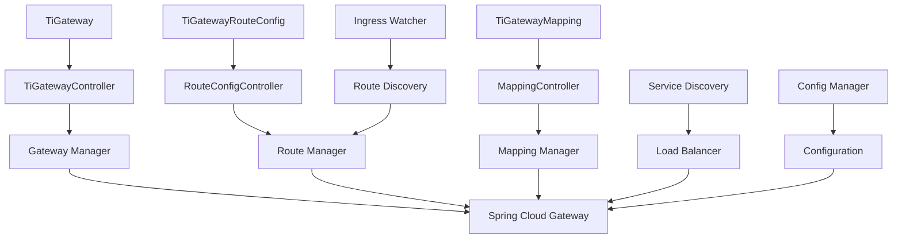

# TiGateway CRDs 开发者指南

## 目录

1. [概述](#概述)
2. [架构设计](#架构设计)
3. [CRD 设计原理](#crd-设计原理)
4. [扩展开发](#扩展开发)
5. [自定义控制器](#自定义控制器)
6. [测试指南](#测试指南)
7. [贡献指南](#贡献指南)

## 概述

TiGateway CRDs 开发者指南面向希望深入了解 TiGateway 内部实现、进行二次开发或贡献代码的开发者。本指南将详细介绍 CRD 的设计原理、架构实现和扩展开发方法。

### 目标读者

- Kubernetes 开发者
- API 网关开发者
- DevOps 工程师
- 系统架构师

### 技术栈

- **Kubernetes**: 1.19+
- **Go**: 1.19+
- **Kubebuilder**: 3.0+
- **Helm**: 3.0+
- **Spring Cloud Gateway**: 3.0+

## 架构设计

### 整体架构

```
┌─────────────────────────────────────────────────────────────┐
│                    TiGateway CRDs 架构                        │
├─────────────────────────────────────────────────────────────┤
│  ┌─────────────┐  ┌─────────────┐  ┌─────────────┐          │
│  │ TiGateway   │  │TiGatewayRoute│  │TiGatewayMapping│        │
│  │ Controller  │  │Config Controller│ │ Controller  │        │
│  └─────────────┘  └─────────────┘  └─────────────┘          │
├─────────────────────────────────────────────────────────────┤
│  ┌─────────────┐  ┌─────────────┐  ┌─────────────┐          │
│  │ Ingress     │  │ Service     │  │ ConfigMap   │          │
│  │ Watcher     │  │ Discovery   │  │ Manager     │          │
│  └─────────────┘  └─────────────┘  └─────────────┘          │
├─────────────────────────────────────────────────────────────┤
│  ┌─────────────┐  ┌─────────────┐  ┌─────────────┐          │
│  │ Spring Cloud│  │ Kubernetes  │  │ Monitoring  │          │
│  │ Gateway     │  │ Client      │  │ & Logging   │          │
│  └─────────────┘  └─────────────┘  └─────────────┘          │
└─────────────────────────────────────────────────────────────┘
```

### 组件关系



### 数据流

```
1. 用户创建 TiGateway 资源
   ↓
2. TiGatewayController 监听到资源变化
   ↓
3. Controller 创建/更新 Spring Cloud Gateway 实例
   ↓
4. Ingress Watcher 监听 Kubernetes Ingress 资源
   ↓
5. 发现新的 Ingress 资源，更新路由配置
   ↓
6. Route Manager 将路由配置应用到 Gateway
   ↓
7. Gateway 开始处理请求
```

## CRD 设计原理

### 1. TiGateway CRD 设计

#### 设计目标

- **声明式配置**: 通过 YAML 文件声明网关配置
- **Kubernetes 原生**: 完全基于 Kubernetes 资源模型
- **可扩展性**: 支持自定义扩展和过滤器
- **可观测性**: 内置监控和日志支持

#### Schema 设计原则

```yaml
# 核心字段设计
spec:
  # 基础配置
  count: integer                    # 副本数量
  resources: object                 # 资源限制
  
  # 功能配置
  ingress: object                   # Ingress 集成
  api: object                       # API 文档
  sso: object                       # 单点登录
  observability: object             # 可观测性
  
  # 扩展配置
  extensions: object                # 自定义扩展
  securityContext: object           # 安全上下文
  tls: array                        # TLS 配置
```

#### 状态管理

```yaml
status:
  conditions:                       # 状态条件
    - type: Ready
      status: "True"
      reason: "GatewayReady"
      lastTransitionTime: "2023-01-01T00:00:00Z"
  replicas: 3                       # 当前副本数
  ingressRoutes: 10                 # Ingress 路由数
```

### 2. TiGatewayRouteConfig CRD 设计

#### 设计目标

- **路由管理**: 统一管理所有路由配置
- **Ingress 集成**: 支持 Ingress 自动发现
- **OpenAPI 支持**: 完整的 API 文档支持
- **过滤器链**: 灵活的路由过滤器配置

#### 路由配置结构

```yaml
spec:
  service:                          # 默认服务配置
    name: string
    namespace: string
    port: integer
    predicates: []string
    filters: []string
  
  routes:                           # 路由列表
    - title: string
      uri: string
      predicates: []string
      filters: []string
      order: integer
      tags: []string
      
  ingress:                          # Ingress 配置
    autoDiscovery: boolean
    namespace: string
    labelSelector: string
    annotationSelector: string
```

### 3. TiGatewayMapping CRD 设计

#### 设计目标

- **关系映射**: 建立网关和路由配置的关系
- **优先级控制**: 支持路由优先级管理
- **启用控制**: 支持动态启用/禁用映射

#### 映射关系设计

```yaml
spec:
  gatewayRef:                       # 网关引用
    name: string
    namespace: string
  
  routeConfigRef:                   # 路由配置引用
    name: string
    namespace: string
  
  priority: integer                 # 优先级
  enabled: boolean                  # 是否启用
```

## 扩展开发

### 1. 自定义过滤器

#### 创建自定义过滤器

```java
@Component
public class CustomAuthFilter implements GatewayFilter, Ordered {
    
    @Override
    public Mono<Void> filter(ServerWebExchange exchange, GatewayFilterChain chain) {
        // 自定义认证逻辑
        String token = exchange.getRequest().getHeaders().getFirst("Authorization");
        if (isValidToken(token)) {
            return chain.filter(exchange);
        } else {
            exchange.getResponse().setStatusCode(HttpStatus.UNAUTHORIZED);
            return exchange.getResponse().setComplete();
        }
    }
    
    @Override
    public int getOrder() {
        return -100;
    }
    
    private boolean isValidToken(String token) {
        // 实现令牌验证逻辑
        return token != null && token.startsWith("Bearer ");
    }
}
```

#### 注册自定义过滤器

```yaml
# 在 TiGateway 中配置
spec:
  extensions:
    custom:
      - "custom-auth-filter"
    filters:
      customAuth:
        enabled: true
        config:
          secretName: "auth-secret"
```

### 2. 自定义扩展

#### 创建扩展配置

```yaml
apiVersion: v1
kind: ConfigMap
metadata:
  name: custom-extension
  namespace: default
data:
  application.yml: |
    custom:
      auth:
        enabled: true
        provider: "oauth2"
        clientId: "${OAUTH2_CLIENT_ID}"
        clientSecret: "${OAUTH2_CLIENT_SECRET}"
      rate-limit:
        enabled: true
        requests-per-minute: 100
```

#### 在 TiGateway 中引用

```yaml
spec:
  extensions:
    custom:
      - "custom-extension"
```

### 3. 自定义监控指标

#### 实现自定义指标

```java
@Component
public class CustomMetrics {
    
    private final Counter customRequestCounter;
    private final Timer customRequestTimer;
    
    public CustomMetrics(MeterRegistry meterRegistry) {
        this.customRequestCounter = Counter.builder("custom_requests_total")
            .description("Total number of custom requests")
            .register(meterRegistry);
            
        this.customRequestTimer = Timer.builder("custom_request_duration")
            .description("Custom request duration")
            .register(meterRegistry);
    }
    
    public void incrementRequestCount() {
        customRequestCounter.increment();
    }
    
    public void recordRequestDuration(Duration duration) {
        customRequestTimer.record(duration);
    }
}
```

## 自定义控制器

### 1. 创建控制器项目

#### 使用 Kubebuilder 初始化项目

```bash
# 安装 kubebuilder
curl -L -o kubebuilder https://go.kubebuilder.io/dl/latest/$(go env GOOS)/$(go env GOARCH)
chmod +x kubebuilder && mv kubebuilder /usr/local/bin/

# 初始化项目
mkdir tigateway-controller
cd tigateway-controller
kubebuilder init --domain tigateway.cn
kubebuilder create api --group tigateway --version v1 --kind TiGateway
kubebuilder create api --group tigateway --version v1 --kind TiGatewayRouteConfig
kubebuilder create api --group tigateway --version v1 --kind TiGatewayMapping
```

#### 项目结构

```
tigateway-controller/
├── api/
│   └── v1/
│       ├── tigateway_types.go
│       ├── tigatewayrouteconfig_types.go
│       ├── tigatewaymapping_types.go
│       └── groupversion_info.go
├── controllers/
│   ├── tigateway_controller.go
│   ├── tigatewayrouteconfig_controller.go
│   └── tigatewaymapping_controller.go
├── config/
│   ├── crd/
│   ├── rbac/
│   └── manager/
├── main.go
└── go.mod
```

### 2. 实现 TiGateway 控制器

#### 控制器结构

```go
// controllers/tigateway_controller.go
package controllers

import (
    "context"
    "fmt"
    "time"
    
    "k8s.io/apimachinery/pkg/runtime"
    ctrl "sigs.k8s.io/controller-runtime"
    "sigs.k8s.io/controller-runtime/pkg/client"
    "sigs.k8s.io/controller-runtime/pkg/log"
    
    tigatewayv1 "tigateway-controller/api/v1"
)

// TiGatewayReconciler reconciles a TiGateway object
type TiGatewayReconciler struct {
    client.Client
    Scheme *runtime.Scheme
}

//+kubebuilder:rbac:groups=tigateway.tigateway.cn,resources=tigateways,verbs=get;list;watch;create;update;patch;delete
//+kubebuilder:rbac:groups=tigateway.tigateway.cn,resources=tigateways/status,verbs=get;update;patch
//+kubebuilder:rbac:groups=tigateway.tigateway.cn,resources=tigateways/finalizers,verbs=update
//+kubebuilder:rbac:groups=apps,resources=deployments,verbs=get;list;watch;create;update;patch;delete
//+kubebuilder:rbac:groups=core,resources=services,verbs=get;list;watch;create;update;patch;delete
//+kubebuilder:rbac:groups=core,resources=configmaps,verbs=get;list;watch;create;update;patch;delete

func (r *TiGatewayReconciler) Reconcile(ctx context.Context, req ctrl.Request) (ctrl.Result, error) {
    logger := log.FromContext(ctx)
    
    // 获取 TiGateway 资源
    var tigateway tigatewayv1.TiGateway
    if err := r.Get(ctx, req.NamespacedName, &tigateway); err != nil {
        logger.Error(err, "unable to fetch TiGateway")
        return ctrl.Result{}, client.IgnoreNotFound(err)
    }
    
    // 处理 TiGateway 资源
    if err := r.reconcileTiGateway(ctx, &tigateway); err != nil {
        logger.Error(err, "unable to reconcile TiGateway")
        return ctrl.Result{}, err
    }
    
    return ctrl.Result{RequeueAfter: time.Minute * 5}, nil
}

func (r *TiGatewayReconciler) reconcileTiGateway(ctx context.Context, tigateway *tigatewayv1.TiGateway) error {
    logger := log.FromContext(ctx)
    
    // 1. 创建或更新 Deployment
    if err := r.reconcileDeployment(ctx, tigateway); err != nil {
        return fmt.Errorf("failed to reconcile deployment: %w", err)
    }
    
    // 2. 创建或更新 Service
    if err := r.reconcileService(ctx, tigateway); err != nil {
        return fmt.Errorf("failed to reconcile service: %w", err)
    }
    
    // 3. 创建或更新 ConfigMap
    if err := r.reconcileConfigMap(ctx, tigateway); err != nil {
        return fmt.Errorf("failed to reconcile configmap: %w", err)
    }
    
    // 4. 更新状态
    if err := r.updateStatus(ctx, tigateway); err != nil {
        return fmt.Errorf("failed to update status: %w", err)
    }
    
    logger.Info("Successfully reconciled TiGateway", "name", tigateway.Name)
    return nil
}

func (r *TiGatewayReconciler) reconcileDeployment(ctx context.Context, tigateway *tigatewayv1.TiGateway) error {
    // 实现 Deployment 创建/更新逻辑
    return nil
}

func (r *TiGatewayReconciler) reconcileService(ctx context.Context, tigateway *tigatewayv1.TiGateway) error {
    // 实现 Service 创建/更新逻辑
    return nil
}

func (r *TiGatewayReconciler) reconcileConfigMap(ctx context.Context, tigateway *tigatewayv1.TiGateway) error {
    // 实现 ConfigMap 创建/更新逻辑
    return nil
}

func (r *TiGatewayReconciler) updateStatus(ctx context.Context, tigateway *tigatewayv1.TiGateway) error {
    // 更新 TiGateway 状态
    tigateway.Status.Conditions = []tigatewayv1.TiGatewayCondition{
        {
            Type:               "Ready",
            Status:             "True",
            Reason:             "GatewayReady",
            LastTransitionTime: metav1.Now(),
        },
    }
    
    return r.Status().Update(ctx, tigateway)
}

// SetupWithManager sets up the controller with the Manager.
func (r *TiGatewayReconciler) SetupWithManager(mgr ctrl.Manager) error {
    return ctrl.NewControllerManagedBy(mgr).
        For(&tigatewayv1.TiGateway{}).
        Complete(r)
}
```

### 3. 实现 Ingress 监听器

#### Ingress 监听器实现

```go
// controllers/ingress_watcher.go
package controllers

import (
    "context"
    "fmt"
    "time"
    
    "k8s.io/apimachinery/pkg/apis/meta/v1/unstructured"
    "k8s.io/apimachinery/pkg/runtime/schema"
    "k8s.io/apimachinery/pkg/watch"
    "k8s.io/client-go/dynamic"
    "k8s.io/client-go/tools/cache"
    "k8s.io/client-go/util/workqueue"
)

type IngressWatcher struct {
    dynamicClient dynamic.Interface
    queue         workqueue.RateLimitingInterface
    informer      cache.SharedIndexInformer
    stopCh        chan struct{}
}

func NewIngressWatcher(dynamicClient dynamic.Interface) *IngressWatcher {
    return &IngressWatcher{
        dynamicClient: dynamicClient,
        queue:         workqueue.NewRateLimitingQueue(workqueue.DefaultControllerRateLimiter()),
        stopCh:        make(chan struct{}),
    }
}

func (w *IngressWatcher) Start(ctx context.Context) error {
    // 创建 Ingress 资源的 GVR
    gvr := schema.GroupVersionResource{
        Group:    "networking.k8s.io",
        Version:  "v1",
        Resource: "ingresses",
    }
    
    // 创建 Informer
    w.informer = cache.NewSharedIndexInformer(
        &cache.ListWatch{
            ListFunc: func(options metav1.ListOptions) (runtime.Object, error) {
                return w.dynamicClient.Resource(gvr).List(ctx, options)
            },
            WatchFunc: func(options metav1.ListOptions) (watch.Interface, error) {
                return w.dynamicClient.Resource(gvr).Watch(ctx, options)
            },
        },
        &unstructured.Unstructured{},
        time.Minute*10,
        cache.Indexers{},
    )
    
    // 添加事件处理器
    w.informer.AddEventHandler(cache.ResourceEventHandlerFuncs{
        AddFunc:    w.onAdd,
        UpdateFunc: w.onUpdate,
        DeleteFunc: w.onDelete,
    })
    
    // 启动 Informer
    go w.informer.Run(w.stopCh)
    
    // 启动工作队列处理
    go w.processQueue(ctx)
    
    return nil
}

func (w *IngressWatcher) onAdd(obj interface{}) {
    key, err := cache.MetaNamespaceKeyFunc(obj)
    if err != nil {
        return
    }
    w.queue.Add(key)
}

func (w *IngressWatcher) onUpdate(oldObj, newObj interface{}) {
    key, err := cache.MetaNamespaceKeyFunc(newObj)
    if err != nil {
        return
    }
    w.queue.Add(key)
}

func (w *IngressWatcher) onDelete(obj interface{}) {
    key, err := cache.MetaNamespaceKeyFunc(obj)
    if err != nil {
        return
    }
    w.queue.Add(key)
}

func (w *IngressWatcher) processQueue(ctx context.Context) {
    for {
        select {
        case <-ctx.Done():
            return
        default:
            key, quit := w.queue.Get()
            if quit {
                return
            }
            
            if err := w.processItem(ctx, key.(string)); err != nil {
                // 处理错误，重新入队
                w.queue.AddRateLimited(key)
            } else {
                w.queue.Forget(key)
            }
            w.queue.Done(key)
        }
    }
}

func (w *IngressWatcher) processItem(ctx context.Context, key string) error {
    // 处理 Ingress 资源变化
    // 1. 解析 Ingress 资源
    // 2. 检查是否包含 tigateway.cn/auto-discover 注解
    // 3. 更新相关的 TiGatewayRouteConfig
    return nil
}

func (w *IngressWatcher) Stop() {
    close(w.stopCh)
    w.queue.ShutDown()
}
```

## 测试指南

### 1. 单元测试

#### 控制器测试

```go
// controllers/tigateway_controller_test.go
package controllers

import (
    "context"
    "testing"
    "time"
    
    . "github.com/onsi/ginkgo"
    . "github.com/onsi/gomega"
    "k8s.io/apimachinery/pkg/types"
    "sigs.k8s.io/controller-runtime/pkg/reconcile"
    
    tigatewayv1 "tigateway-controller/api/v1"
)

var _ = Describe("TiGateway Controller", func() {
    var (
        ctx    context.Context
        cancel context.CancelFunc
    )
    
    BeforeEach(func() {
        ctx, cancel = context.WithCancel(context.Background())
    })
    
    AfterEach(func() {
        cancel()
    })
    
    Context("When creating a TiGateway", func() {
        It("Should create a Deployment", func() {
            // 创建测试用的 TiGateway 资源
            tigateway := &tigatewayv1.TiGateway{
                ObjectMeta: metav1.ObjectMeta{
                    Name:      "test-gateway",
                    Namespace: "default",
                },
                Spec: tigatewayv1.TiGatewaySpec{
                    Count: 2,
                    Resources: &tigatewayv1.ResourceRequirements{
                        Limits: map[string]string{
                            "cpu":    "500m",
                            "memory": "1Gi",
                        },
                    },
                },
            }
            
            // 创建资源
            Expect(k8sClient.Create(ctx, tigateway)).Should(Succeed())
            
            // 等待控制器处理
            time.Sleep(time.Second * 2)
            
            // 验证 Deployment 是否创建
            deployment := &appsv1.Deployment{}
            Eventually(func() error {
                return k8sClient.Get(ctx, types.NamespacedName{
                    Name:      "test-gateway",
                    Namespace: "default",
                }, deployment)
            }, time.Second*10, time.Millisecond*100).Should(Succeed())
            
            // 验证 Deployment 配置
            Expect(*deployment.Spec.Replicas).Should(Equal(int32(2)))
        })
    })
})
```

#### 过滤器测试

```java
// CustomAuthFilterTest.java
@ExtendWith(MockitoExtension.class)
class CustomAuthFilterTest {
    
    @Mock
    private ServerWebExchange exchange;
    
    @Mock
    private GatewayFilterChain chain;
    
    @Mock
    private ServerHttpRequest request;
    
    @Mock
    private ServerHttpResponse response;
    
    @Mock
    private HttpHeaders headers;
    
    private CustomAuthFilter filter;
    
    @BeforeEach
    void setUp() {
        filter = new CustomAuthFilter();
        when(exchange.getRequest()).thenReturn(request);
        when(exchange.getResponse()).thenReturn(response);
        when(request.getHeaders()).thenReturn(headers);
    }
    
    @Test
    void shouldAllowValidToken() {
        // Given
        when(headers.getFirst("Authorization")).thenReturn("Bearer valid-token");
        when(chain.filter(exchange)).thenReturn(Mono.empty());
        
        // When
        Mono<Void> result = filter.filter(exchange, chain);
        
        // Then
        StepVerifier.create(result)
            .verifyComplete();
        verify(chain).filter(exchange);
    }
    
    @Test
    void shouldRejectInvalidToken() {
        // Given
        when(headers.getFirst("Authorization")).thenReturn("Invalid token");
        when(response.setStatusCode(any())).thenReturn(response);
        when(response.setComplete()).thenReturn(Mono.empty());
        
        // When
        Mono<Void> result = filter.filter(exchange, chain);
        
        // Then
        StepVerifier.create(result)
            .verifyComplete();
        verify(response).setStatusCode(HttpStatus.UNAUTHORIZED);
        verify(chain, never()).filter(exchange);
    }
}
```

### 2. 集成测试

#### 端到端测试

```yaml
# test/e2e/test-gateway.yaml
apiVersion: tigateway.cn/v1
kind: TiGateway
metadata:
  name: e2e-test-gateway
  namespace: default
spec:
  count: 1
  resources:
    limits:
      cpu: 200m
      memory: 512Mi
  ingress:
    enabled: true
    namespace: default
  api:
    title: "E2E Test Gateway"
    version: "1.0.0"
---
apiVersion: tigateway.cn/v1
kind: TiGatewayRouteConfig
metadata:
  name: e2e-test-routes
  namespace: default
spec:
  routes:
    - title: "Test Route"
      uri: "lb://test-service"
      predicates:
        - "Path=/test/**"
      filters:
        - "StripPrefix=1"
      order: 1
---
apiVersion: tigateway.cn/v1
kind: TiGatewayMapping
metadata:
  name: e2e-test-mapping
  namespace: default
spec:
  gatewayRef:
    name: e2e-test-gateway
    namespace: default
  routeConfigRef:
    name: e2e-test-routes
    namespace: default
```

#### 测试脚本

```bash
#!/bin/bash
# test/e2e/run-e2e-tests.sh

set -e

echo "Running E2E tests for TiGateway CRDs..."

# 1. 部署测试资源
kubectl apply -f test/e2e/test-gateway.yaml

# 2. 等待资源就绪
echo "Waiting for TiGateway to be ready..."
kubectl wait --for=condition=Ready tigateway/e2e-test-gateway --timeout=300s

# 3. 验证 Deployment
echo "Verifying Deployment..."
kubectl get deployment e2e-test-gateway -o yaml

# 4. 验证 Service
echo "Verifying Service..."
kubectl get service e2e-test-gateway -o yaml

# 5. 验证 ConfigMap
echo "Verifying ConfigMap..."
kubectl get configmap e2e-test-gateway-config -o yaml

# 6. 测试路由
echo "Testing routes..."
kubectl port-forward service/e2e-test-gateway 8080:80 &
PF_PID=$!

sleep 5

# 测试健康检查
curl -f http://localhost:8080/actuator/health || exit 1

# 测试路由
curl -f http://localhost:8080/test/health || exit 1

# 清理
kill $PF_PID
kubectl delete -f test/e2e/test-gateway.yaml

echo "E2E tests completed successfully!"
```

### 3. 性能测试

#### 负载测试

```yaml
# test/performance/load-test.yaml
apiVersion: batch/v1
kind: Job
metadata:
  name: load-test
  namespace: default
spec:
  template:
    spec:
      containers:
      - name: load-test
        image: loadimpact/k6:latest
        command:
        - k6
        - run
        - -u
        - "100"
        - -d
        - "5m"
        - /scripts/load-test.js
        volumeMounts:
        - name: scripts
          mountPath: /scripts
      volumes:
      - name: scripts
        configMap:
          name: load-test-scripts
      restartPolicy: Never
---
apiVersion: v1
kind: ConfigMap
metadata:
  name: load-test-scripts
  namespace: default
data:
  load-test.js: |
    import http from 'k6/http';
    import { check } from 'k6';
    
    export let options = {
      stages: [
        { duration: '2m', target: 100 },
        { duration: '5m', target: 100 },
        { duration: '2m', target: 0 },
      ],
    };
    
    export default function() {
      let response = http.get('http://gateway-service:80/test/health');
      check(response, {
        'status is 200': (r) => r.status === 200,
        'response time < 100ms': (r) => r.timings.duration < 100,
      });
    }
```

## 贡献指南

### 1. 开发环境设置

#### 环境要求

```bash
# 安装 Go
go version  # 需要 1.19+

# 安装 kubebuilder
curl -L -o kubebuilder https://go.kubebuilder.io/dl/latest/$(go env GOOS)/$(go env GOARCH)
chmod +x kubebuilder && mv kubebuilder /usr/local/bin/

# 安装 kustomize
go install sigs.k8s.io/kustomize/kustomize/v4@latest

# 安装 controller-gen
go install sigs.k8s.io/controller-tools/cmd/controller-gen@latest

# 安装 ginkgo
go install github.com/onsi/ginkgo/v2/ginkgo@latest
```

#### 项目设置

```bash
# 克隆项目
git clone https://github.com/tigateway/tigateway.git
cd tigateway

# 安装依赖
go mod download

# 生成代码
make generate

# 运行测试
make test
```

### 2. 代码规范

#### Go 代码规范

```go
// 1. 包注释
// Package controllers contains the controller implementations for TiGateway CRDs.
package controllers

// 2. 函数注释
// reconcileTiGateway reconciles a TiGateway resource by creating or updating
// the associated Kubernetes resources.
func (r *TiGatewayReconciler) reconcileTiGateway(ctx context.Context, tigateway *tigatewayv1.TiGateway) error {
    // 实现逻辑
}

// 3. 错误处理
if err != nil {
    return fmt.Errorf("failed to reconcile deployment: %w", err)
}

// 4. 日志记录
logger := log.FromContext(ctx)
logger.Info("Successfully reconciled TiGateway", "name", tigateway.Name)
```

#### YAML 规范

```yaml
# 1. 使用 2 个空格缩进
# 2. 字符串使用双引号
# 3. 布尔值使用小写
# 4. 数组使用短横线格式

apiVersion: tigateway.cn/v1
kind: TiGateway
metadata:
  name: "example-gateway"
  namespace: "default"
  labels:
    app: "tigateway"
    environment: "production"
spec:
  count: 2
  resources:
    limits:
      cpu: "500m"
      memory: "1Gi"
  ingress:
    enabled: true
    namespace: "default"
```

### 3. 提交流程

#### 分支管理

```bash
# 1. 创建功能分支
git checkout -b feature/new-feature

# 2. 提交更改
git add .
git commit -m "feat: add new feature"

# 3. 推送分支
git push origin feature/new-feature

# 4. 创建 Pull Request
```

#### 提交信息规范

```
<type>(<scope>): <subject>

<body>

<footer>
```

类型：
- `feat`: 新功能
- `fix`: 修复
- `docs`: 文档
- `style`: 格式
- `refactor`: 重构
- `test`: 测试
- `chore`: 构建过程或辅助工具的变动

示例：
```
feat(controller): add Ingress auto-discovery support

Add automatic discovery of Kubernetes Ingress resources
and convert them to TiGateway routes.

- Implement Ingress watcher
- Add route conversion logic
- Update CRD schema

Closes #123
```

### 4. 测试要求

#### 测试覆盖率

```bash
# 运行测试并生成覆盖率报告
go test -coverprofile=coverage.out ./...
go tool cover -html=coverage.out -o coverage.html
```

#### 测试要求

- 单元测试覆盖率 > 80%
- 集成测试覆盖主要功能
- 性能测试验证关键路径

### 5. 文档要求

#### 代码文档

- 所有公共函数必须有注释
- 复杂逻辑需要行内注释
- 示例代码需要完整可运行

#### 用户文档

- 新功能需要更新用户手册
- API 变更需要更新 API 参考
- 示例需要包含完整配置

## 总结

TiGateway CRDs 开发者指南提供了完整的开发、测试和贡献流程。通过遵循本指南，开发者可以：

1. **理解架构**: 深入了解 TiGateway 的内部实现
2. **扩展功能**: 开发自定义过滤器和扩展
3. **贡献代码**: 按照规范提交高质量的代码
4. **测试验证**: 确保代码质量和功能正确性

本指南将随着项目的发展持续更新，为开发者提供最新的技术信息和最佳实践。